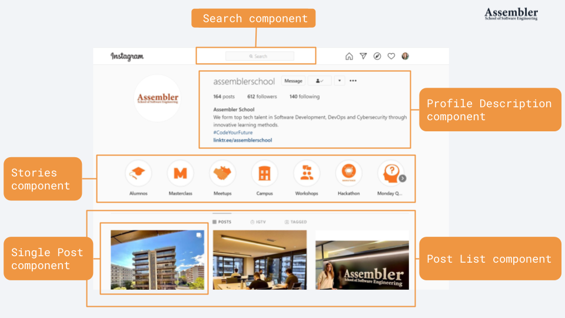
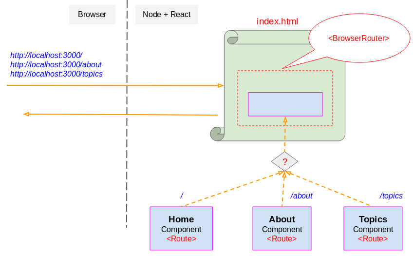
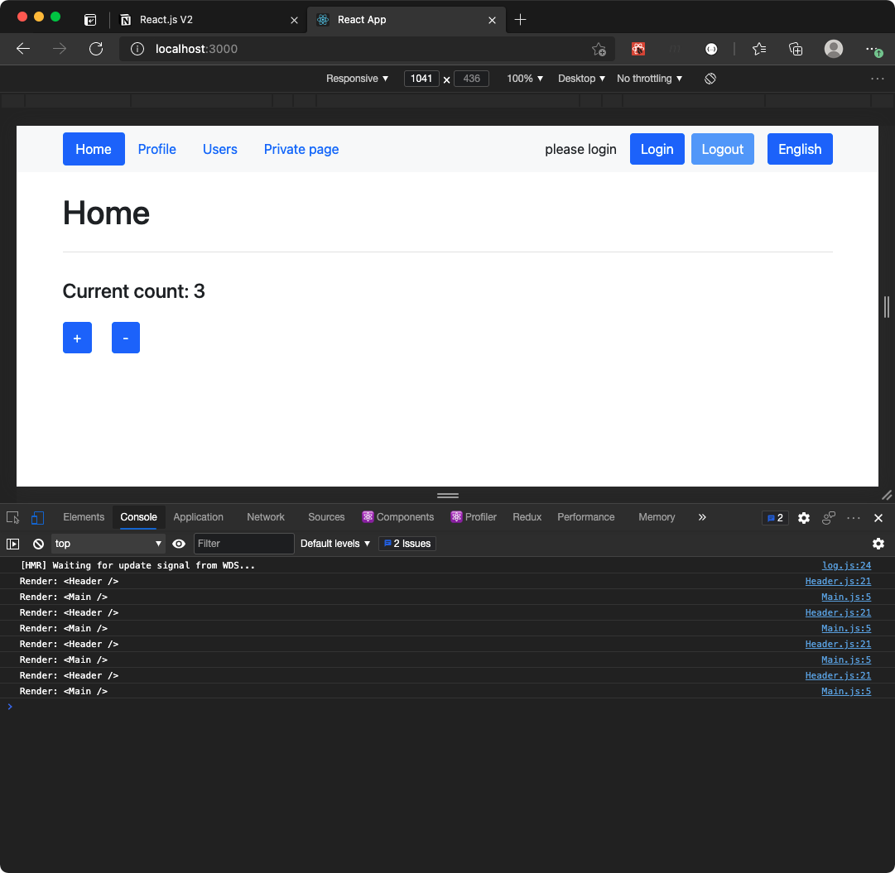
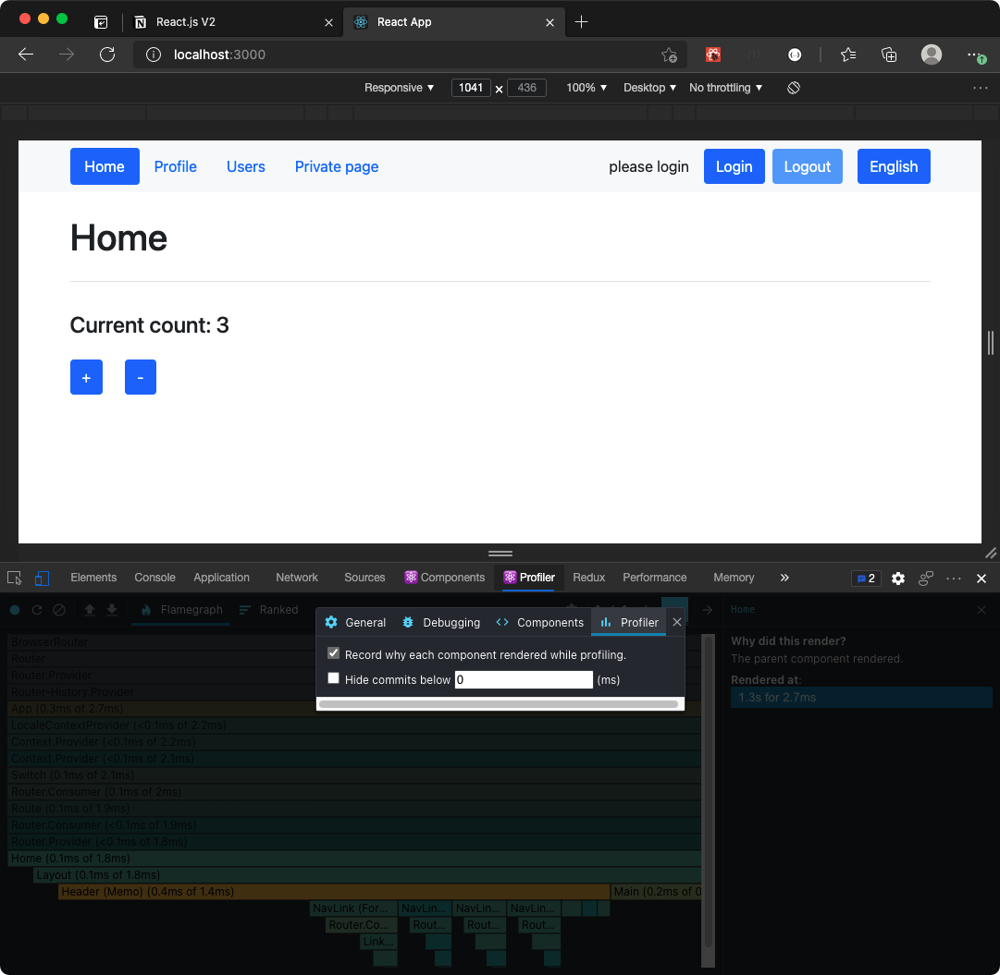
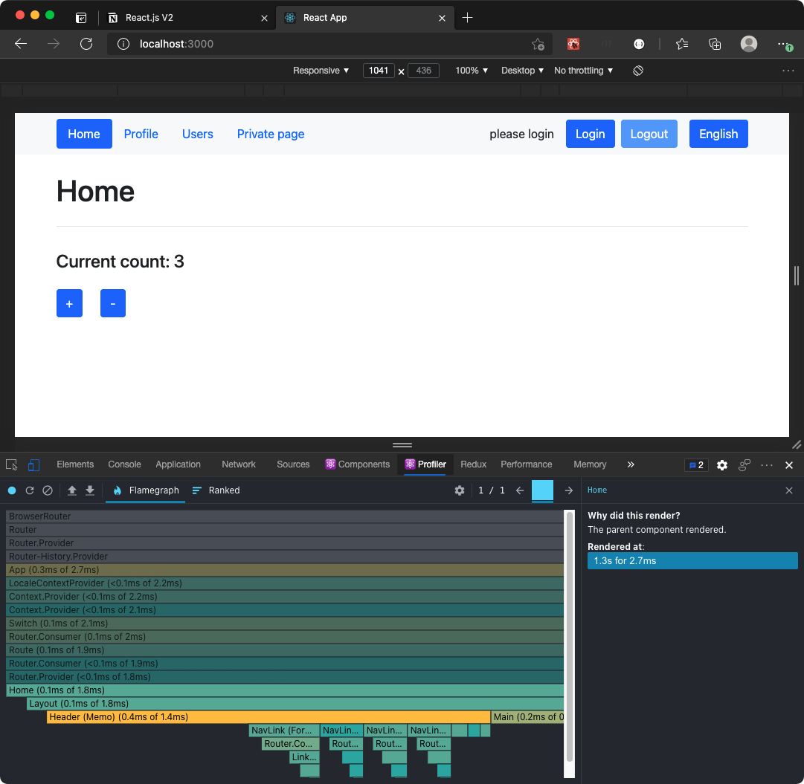
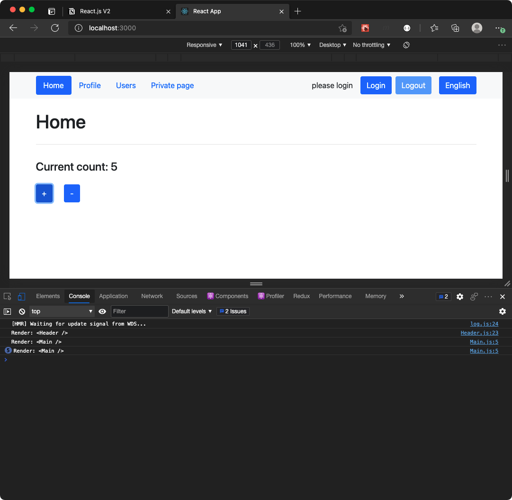
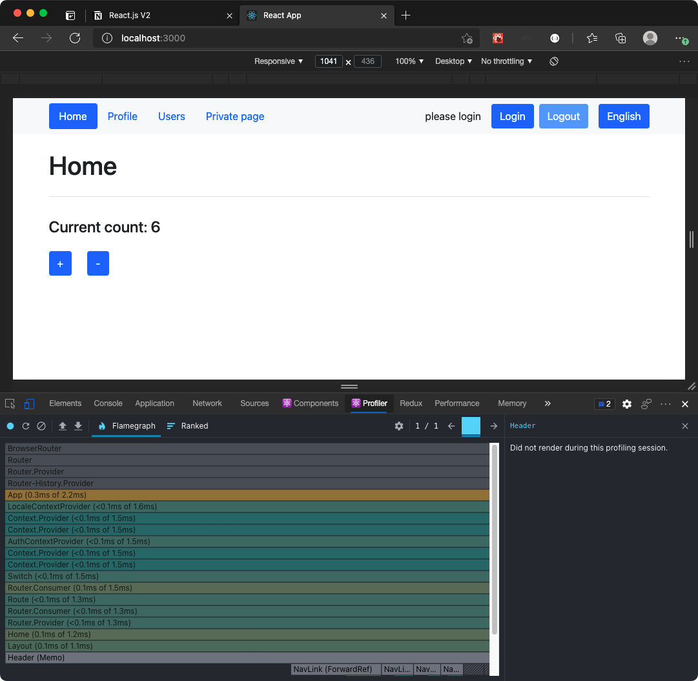

`#react.js-intro` `#assembler-school` `#master-in-software-engineering`

<!-- ALL-CONTRIBUTORS-BADGE:START - Do not remove or modify this section -->

[](#contributors-)

<!-- ALL-CONTRIBUTORS-BADGE:END -->

# Assembler School: React.js Intro Workshop <!-- omit in toc -->

In this workshop we will learn how to use React.js to build modern SPA.

## Getting Started

### The repository

First, you will need to clone the repo:

```bash
$ git clone https://github.com/assembler-school/react-js-intro.git
```

### Dependencies

Before we can get started you will need to make sure that all the necessary dependencies are installed in your system.

### Create React App

This project was bootstrapped with [Create React App](https://github.com/facebook/create-react-app).

### Available Scripts

In the project directory, you can run:

#### `npm run start`

Runs the app in the development mode.\
Open [http://localhost:3000](http://localhost:3000) to view it in the browser.

The page will reload if you make edits.\
You will also see any lint errors in the console.

#### `npm run test`

Launches the test runner in the interactive watch mode.\
See the section about [running tests](https://facebook.github.io/create-react-app/docs/running-tests) for more information.

### Contents and Branches Naming Strategy

The repository is made up of several branches that include the contents of each section.

The main branch includes the base repository and the getting started with React.js guide while the following include more advanced concepts such as working with forms or the Context API.

Each branch adds more contents to the `README.md` file and the folder structure.

### Fetching All the Branches

In order to fetch all the remote branches in the repository you can use the following command or by creating a fork of this current repository.

```bash
$ git fetch --all

# List both remote-tracking branches and local branches
$ git branch --all
```

Then, you can create a local branch based on a remote branch with the following command:

```bash
$ git checkout -b <new_branch_name> <remote_branch_name>
```

## Table of Contents <!-- omit in toc -->

- [Getting Started](#getting-started)
- [Part I. What is React?](#part-i-what-is-react)
- [Why use react?](#why-use-react)
- [Creating a React App](#creating-a-react-app)
- [JSX](#jsx)
- [Render](#render)
- [React Only Updates What’s Necessary](#react-only-updates-whats-necessary)
- [Components and Props](#components-and-props)
- [Styles In React.js](#styles-in-reactjs)
- [Lists and Keys](#lists-and-keys)
- [Part II. State and Lifecycle](#part-ii-state-and-lifecycle)
- [Lifecycle Methods](#lifecycle-methods)
- [Using State Correctly](#using-state-correctly)
- [The Data Flows Down](#the-data-flows-down)
- [Handling Events](#handling-events)
- [Practical Examples](#practical-examples)
- [Part III. Forms and Events](#part-iii-forms-and-events)
- [Controlled Components](#controlled-components)
- [Handling Multiple Inputs](#handling-multiple-inputs)
- [Part IV. Formik](#part-iv-formik)
- [Part V. React Router Intro](#part-v-react-router-intro)
- [Quick Start](#quick-start)
- [BrowserRouter](#browserrouter)
- [Part VI. Higher-Order Components](#part-vi-higher-order-components)
- [Use HOCs For Cross-Cutting Concerns](#use-hocs-for-cross-cutting-concerns)
- [A First Example: `withData(Component)`](#a-first-example-withdatacomponent)
- [A Second Example: `withAuth(Component)`](#a-second-example-withauthcomponent)
- [Part VII. React Context](#part-vii-react-context)
- [Avoiding Prop Drilling With React Context](#avoiding-prop-drilling-with-react-context)
- [`Context.Consumer`](#contextconsumer)
- [Using Multiple Contexts](#using-multiple-contexts)
- [Part VIII. `useReducer()`](#part-viii-usereducer)
- [Part IX. Combining Context with `useReducer()`](#part-ix-combining-context-with-usereducer)
- [Part X. Caveats When Using Context](#part-x-caveats-when-using-context)
- [Caveats](#caveats)
- [Learn More About Create React App](#learn-more-about-create-react-app)

---

## Part I. What is React?

React is a JavaScript library for building user interfaces. It is an open-source, component-based, front-end library responsible only for the application’s view layer.

React is the most popular front-end JavaScript library in the field of web development. It was created by Jordan Walke, a software engineer at Facebook.

### Instagram Made With React.js

Let’s take a look at an Instagram webpage example, entirely built using React, to get a better understanding of how React works.



As the illustration shows, with React we divide the UI into multiple components, which makes the code easier to debug. This way, each component has its property and function.

This would be an example of what that would look like in `JSX`

```jsx
function App() {
  return (
    <div className="App">
      <Search />
      <ProfileDescription />
      <Stories />
      <SinglePost />
      <PostList />
    </div>
  );
}
```

## Why use react?

Now that we know what React is, let’s move on and see why React is the most popular front-end library for web application development.

#### ✅ Improved Performance

React uses a Virtual DOM and compares the components’ previous states and updates only the items in the Real DOM that were changed, instead of updating all of the components again, as conventional web applications do.

#### ✅ Reusable Components

Components can be reused throughout the application, which in turn dramatically reduces the application’s development time.

#### ✅ Unidirectional Data Flow

When designing a React app, developers often nest child components within parent components and it becomes easier to debug errors and know where a problem occurs in an application at the moment in question.

#### ✅ Small Learning Curve

It can be used for the development of both web and mobile apps: There is a framework called React Native, derived from React itself, that is used for creating beautiful mobile applications.

#### ✅ Dedicated Tools for Easy Debugging

React also has a Chrome extension that can be used to debug React applications.

## Creating a React App

To start using React we only need to install the official Create React App package.

However this project was already bootstrapped with it so you can try it out in a different folder on your computer.

```sh
npm i -g create-react-app
```

Command to build a react app from scratch after we have installed it:

```sh
create-react-app myapp
```

### Folder Structure

This is a sample folder structure that the `create-react-app` cli tool creates. This is the most common folder structure of a React app, although you can modify it if you need to.

```sh
.
├── LICENSE
├── README.md
├── node_modules
├── package-lock.json
├── package.json
├── public
└── src
```

#### `/public`

`/public` is where your static files reside. If the file is not imported by your JavaScript application and must maintain its file name, put it here.

Files in the public directory will maintain the same file name in production, which typically means that they will be cached by your client and never downloaded again.

```sh
public
├── favicon.ico
├── index.html
├── logo192.png
├── logo512.png
├── manifest.json
└── robots.txt
```

#### `/src`

`/src` is where your dynamic files reside. If the file is imported by your JavaScript application or changes contents, put it here.

> ⚠️ The fields listed bellow are the ones that the base Create React App cli tool installs by default, some of them are removed in this repo because we don't need them.

```sh
src
├── App.js
├── App.css
├── App.test.js
├── index.css
├── index.js
├── logo.svg
├── serviceWorker.js
├── reportWebVitals.js
└── setupTests.js
```

## JSX

JSX is a syntax extension to JavaScript. It is used with React to describe what the user interface should look like. By using JSX, we can write HTML structures in the same file that contains JavaScript code. This makes the code easier to understand and debug, as it avoids the usage of complex JavaScript DOM structures.

JSX Example:

```jsx
function App() {
  const fullName = "Josh Perez";

  const element = <h1>Hello, {fullName}</h1>;

  return element;
}
```

```jsx
function App() {
  return <PostList />;
}

function PostList() {
  const posts = [
    { id: 1, title: "post 1" },
    { id: 2, title: "post 2" },
  ];

  return posts.map((el) => <div key={el.id}>{el.title}</div>);
}
```

### Specifying Attributes with JSX

- You can use quotes to specify string literals as attributes.
- You can also use curly braces to embed a JavaScript expression in an attribute.

```jsx
function App() {
  return <Button id="1" />;
}

function Button(props) {
  return <button id={props.id}>Click id: {props.id}</button>;
}
```

### Specifying Children with JSX

We can also use the `children` prop to render child elements of a component.

```jsx
function App() {
  function handleClick(event) {
    console.log(event.target);
  }
  return <Button handleClick={handleClick}>Click Me</Button>;
}

function Button(props) {
  return <button onClick={props.handleClick}>{props.children}</button>;
}
```

## Render

The `render()` method is used to convert JSX code is to regular JavaScript at runtime. After translation, JSX code looks like this:

```jsx
const element = <h1>Hello, world</h1>;

ReactDOM.render(element, document.getElementById("root"));
```

### Updating the Rendered Element

React elements are **immutable**. Once you create an element, you can’t change its children or attributes. An element is like a single frame in a movie: it represents the UI at a certain point in time.

```jsx
import { useState } from "react";

function App() {
  const [count, setCount] = useState(0);

  function handleClick() {
    setCount((prevCount) => (prevCount += 1));
  }
  return <Button handleClick={handleClick} count={count} />;
}

function Button(props) {
  return (
    <div>
      <p>{props.count}</p>
      <button onClick={props.handleClick}>Increment</button>
    </div>
  );
}

export default App;
```

## React Only Updates What’s Necessary

After looking at the workshop demo we can see that React DOM compares the element and its children to the previous one, and **only applies the DOM updates necessary** to bring the DOM to the desired state.

## Components and Props

Components let you split the UI into independent, reusable pieces, and think about each piece in isolation.

The simplest way to define a component is to write a JavaScript function:

```jsx
import React from "react";

function App() {
  return (
    <div>
      <Welcome name="developer" />
      <SecondWelcome name="developer" />
    </div>
  );
}

// Using a functional component
function Welcome(props) {
  // Notice that a functional component should have a return statement
  return <h3>Hello {props.name}</h3>;
}

// Or a class component
class SecondWelcome extends Component {
  // Notice that class components should have a render method
  render() {
    return <h1>Hello {this.props.name} from a class</h1>;
  }
}

export default App;
```

### What are props?

React is a **component-based library** that divides the UI into little reusable pieces. In some cases, those components need to communicate (send data to each other) and the way to pass data between components is by using props.

`props` is a special keyword in React, which stands for properties and is being used for passing data from one component to another.

```jsx
import React from "react";

class Welcome extends Component {
  render() {
    return <h1>Hello {this.props.name}</h1>;
  }
}

function App() {
  return (
    <div className="App">
      <Welcome name="Assembler" />
    </div>
  );
}

export default App;
```

### Splitting Components

Don’t be afraid to split components into smaller components.
For example, consider this App component:

```jsx
import React from "react";
import img from "./img/react-components-intro.png";

import "./App.scss";

function App() {
  return (
    <div className="App">
      <h1>Hello Assembler</h1>
      <div>
        
        <div>
          <p>Code your future!</p>
        </div>
      </div>
    </div>
  );
}

export default App;
```

Let’s extract a few components from `<App />` component.

Extracting components might seem like grunt work at first, but having a palette of reusable components pays off in larger apps.

```jsx
function Welcome(props) {
  return <h3>Hello {props.name}</h3>;
}

function AssemblerLogo(props) {
  return ;
}

function AssemblerText(props) {
  return <p>Code your future!</p>;
}
```

Now we can render the components in our `<App />` component.

```jsx
import React from "react";
import img from "./img/react-components-intro.png";

import "./App.scss";

function App() {
  return (
    <div className="App">
      <Welcome name="developer" />
      <div>
        <AssemblerLogo img={img} />
        <div>
          <AssemblerText />
        </div>
      </div>
    </div>
  );
}

function Welcome(props) {
  return <h3>Hello {props.name}</h3>;
}

function AssemblerLogo(props) {
  return ;
}

function AssemblerText() {
  return <p>Code your future!</p>;
}

export default App;
```

### Extracting Components in Modules

In React, usually all components are extracted in modules so that they can be reused.

The main way we create components is inside a `src/components` folder:

```jsx
// src/components/Button/Button.js

import React from "react";

function Button({ children }) {
  return <button>{children}</button>;
}

export default Button;
```

And then we can import it inside our `App.js` component.

```jsx
// src/App.js

import React from "react";

import Button from "./components/Button/Button";

class App extends Component {
  render() {
    return (
      <div>
        <Button>Hello </Button>
      </div>
    );
  }
}

export default App;
```

However, if we take a closer look at the import we can see that we need to specify the component name and folder twice:

```jsx
import Button from "./components/Button/Button";
```

One way we can solve this is to use an `index.js` file that exports the component from the main folder:

```jsx
// src/components/Button/index.js
export { default } from "./Button";
```

Then we can import it like so:

```jsx
// src/App.js

import React from "react";

import Button from "./components/Button";

class App extends Component {
  render() {
    return (
      <div>
        <Button>Hello </Button>
      </div>
    );
  }
}

export default App;
```

## Styles In React.js

With React.js we can define `.scss` or `.css` files that we can use to style our apps.

The main way we use styles in React is with a `.css` or `.scss` file that is stored as close as possible to the component that needs it.

```sh
src/components/Button
├── Button.js
├── Button.scss
└── index.js
```

```scss
// src/components/Button/Button.scss

.Button {
  background-color: darkslateblue;
  color: white;
  padding: 1rem;
  margin: 1rem;
}
```

```jsx
// src/components/Button/Button.js

import React from "react";

import "./Button.scss";

function Button({ children }) {
  return <button className="Button">{children}</button>;
}

export default Button;
```

```jsx
// src/App.js

import React from "react";

import Button from "./components/Button";

class App extends Component {
  render() {
    return (
      <div>
        <Button>Hello </Button>
      </div>
    );
  }
}

export default App;
```

Another way is by using Bootstrap.

First, we need to install it:

```sh
npm i bootstrap
```

Then, we need to import it in our app:

```jsx
// src/index.js
import React from "react";
import ReactDOM from "react-dom";

import "bootstrap/dist/css/bootstrap.min.css";

import App from "./App";
import reportWebVitals from "./reportWebVitals";

ReactDOM.render(
  <React.StrictMode>
    <App />
  </React.StrictMode>,
  document.getElementById("root")
);
```

Now we can add the classes to our `Button` component.

```jsx
// src/components/Button/Button.js

import React from "react";

function Button({ children }) {
  return <button className="btn btn-primary m-5">{children}</button>;
}

export default Button;
```

## Lists and Keys

Now that we know how to create components lets see how we can render a dynamic list of elements.

If we import the `getPosts()` function from the `/src/utils` folder we can use it to render the posts using `Array.map()`.

```jsx
import React, { Component } from "react";

import { getPosts } from "./utils/data";

class App extends Component {
  render() {
    return (
      <main>
        <article className="row-cols-1">
          <div className="col">
            <h1>Posts</h1>
          </div>
          {getPosts().map((post) => (
            <div className="col">
              <h2 className="h4">{post.title}</h2>
              <p className="text-grey">{post.description}</p>
            </div>
          ))}
        </article>
      </main>
    );
  }
}

export default App;
```

However, we can see in the browser console the following error:

```js
index.js:1 Warning: Each child in a list should have a unique "key" prop.

Check the render method of `App`. See https://reactjs.org/link/warning-keys for more information.
    at div
    at App (http://localhost:3000/static/js/main.chunk.js:25:1)
```

This is because any time we render JSX elements dynamically we need to specify a `key` prop so that React can identify each rendered element in the final JSX code:

```diff
import React, { Component } from "react";

import { getPosts } from "./utils/data";

class App extends Component {
  render() {
    return (
      <main>
        <article className="row-cols-1">
          <div className="col">
            <h1>Posts</h1>
          </div>
          {getPosts().map((post) => (
-           <div className="col">
+           <div key={post.id} className="col">
              <h2 className="h4">{post.title}</h2>
              <p className="text-grey">{post.description}</p>
            </div>
          ))}
        </article>
      </main>
    );
  }
}

export default App;
```

---

## Part II. State and Lifecycle

Like props, state holds information about the component. However, the kind of information and how it is handled is different.

By default, a component has no state.

For example, this component has no state:

```jsx
function App() {
  const count = 1;

  return (
    <Main>
      <section className="row">
        <div className="col col-12">
          <h1>The current count is: {count}</h1>
        </div>
      </section>
    </Main>
  );
}
```

Neither does this one, even though it is created using a class:

```jsx
class Welcome extends Component {
  render() {
    return <h1>Hello {this.props.name}</h1>;
  }
}
```

### So When Would You Use State?

When a component needs to keep track of information between renderings the component itself can create, update, and use state.

We’ll be working with a fairly simple component to see state working in action.

### Modifying the State

Changing the state should only be done from inside a component through the `this.setState()` method.

React exposes the `setState()` method on the component instance to update it so that react finds out data change and can re-render the view.

```jsx
import React, { Component } from "react";

import Button from "./components/Button";
import Main from "./components/Main";

class App extends Component {
  constructor(props) {
    super(props);
    this.state = {
      count: 0,
    };

    this.increment = this.increment.bind(this);
  }

  increment() {
    const { count } = this.state;
    this.setState({ count: count + 1 });
  }

  render() {
    const { count } = this.state;

    return (
      <Main>
        <section className="row">
          <div className="col col-12">
            <h1>The current count is: {count}</h1>
          </div>
          <div className="col col-12">
            <Button onClick={this.increment}>increment</Button>
          </div>
        </section>
      </Main>
    );
  }
}

export default App;
```

## Lifecycle Methods

React components have several lifecycle methods which you can monitor and manipulate during its three main phases.

The three phases are: **Mounting**, **Updating**, and **Unmounting**.

### Mounting

Mounting means putting elements into the DOM. React has several built-in methods that gets called, in this order, when mounting a component, but these are the common ones:

- `constructor()`
- `render()`
- `componentDidMount()`

The `render()` method is required and will always be called, the others are optional and will be called if you define them.

### `constructor()`

The `constructor()` method is called before anything else, when the component is initiated, and it is the natural place to set up the initial state and other initial values.

```jsx
class App extends Component {
  constructor(props) {
    super(props);
    this.state = {
      count: 0,
    };
  }

  render() {
    const { count } = this.state;

    return (
      <Main>
        <section className="row">
          <div className="col col-12">
            <h1>The current count is: {count}</h1>
          </div>
        </section>
      </Main>
    );
  }
}
```

### `render()`

The `render()` method is always required, and is the method that actually outputs the HTML to the DOM.

```jsx
class App extends Component {
  constructor(props) {
    super(props);
    this.state = {
      count: 0,
    };
  }

  render() {
    const { count } = this.state;

    return (
      <Main>
        <section className="row">
          <div className="col col-12">
            <h1>The current count is: {count}</h1>
          </div>
        </section>
      </Main>
    );
  }
}
```

### `componentDidMount`

The `componentDidMount()` method is called after the component is rendered. This is where you run statements that requires that the component is already placed in the DOM.

At first my favorite color is red, but give me a second, and it is yellow instead:

```jsx
class Example extends Component {
  constructor(props) {
    super(props);
    this.state = { favoriteColor: "red" };
  }

  componentDidMount() {
    setTimeout(() => {
      this.setState({ favoriteColor: "yellow" });
    }, 1000);
  }

  render() {
    const { favoriteColor } = this.state;

    return <h1>My Favorite Color is {favoriteColor}</h1>;
  }
}
```

### Updating

The next phase in the lifecycle is when a component is updated. A component is updated whenever there is a change in the component's state or props.

React calls the following methods, in this order, when a component is updated:

- `render()`
- `componentDidUpdate()`

The `render()` method is required and will always be called, the others are optional and will be called if you define them.

```jsx
class Example extends Component {
  constructor(props) {
    super(props);
    this.state = { favoriteColor: "red" };
  }

  componentDidMount() {
    setTimeout(() => {
      this.setState({ favoriteColor: "yellow" });
    }, 1000);
  }

  componentDidUpdate() {
    const { favoriteColor } = this.state;
    console.log(`The updated favorite is ${favoriteColor}`);
  }

  render() {
    const { favoriteColor } = this.state;

    return (
      <div>
        <h1>My Favorite Color is {favoriteColor}</h1>
      </div>
    );
  }
}
```

### Unmounting

The next phase in the lifecycle is when a component is removed from the DOM, or unmounting as React likes to call it.

React has only one built-in method that gets called when a component is unmounted:

- `componentWillUnmount()`

```jsx
class Child extends Component {
  componentWillUnmount() {
    console.log("Example component is about to be unmounted.");
  }

  render() {
    return <h1>Hello Assembler!</h1>;
  }
}

class App extends Component {
  constructor(props) {
    super(props);
    this.state = {
      show: true,
    };

    this.handleRemove = this.handleRemove.bind(this);
  }

  handleRemove() {
    this.setState((prevState) => ({
      ...prevState,
      show: !prevState.show,
    }));
  }

  render() {
    const { show } = this.state;

    return (
      <Main>
        <section className="row">
          <div className="col col-12">
            <Button onClick={this.handleRemove}>remove child</Button>
          </div>
          <div className="col col-12">{show ? <Child /> : null}</div>
        </section>
      </Main>
    );
  }
}
```

## Using State Correctly

There are three things you should know about `setState()`.

### 1. Do Not Modify State Directly

For example, this will not re-render a component. The only place where you can assign `this.state` is the constructor.

```jsx
// Wrong
this.state.comment = "Hello";

// Instead, use setState():

// Correct
this.setState({ comment: "Hello" });
```

### 2. State Updates May Be Asynchronous

React may batch multiple `setState()` calls into a single update for performance. Because this.props and this.state may be updated asynchronously, you should not rely on their values for calculating the next state.

#### Wrong Way to Update State

For example, this code may fail to update the counter:

```jsx
class App extends Component {
  constructor(props) {
    super(props);

    this.state = {
      count: 0,
    };

    this.increment = this.increment.bind(this);
  }

  increment() {
    this.setState({
      count: this.state.count + 1,
    });

    this.setState({
      count: this.state.count + 1,
    });

    this.setState({
      count: this.state.count + 1,
    });
  }

  render() {
    const { count } = this.state;

    return (
      <Main>
        <section className="row">
          <div className="col col-12">
            <Button onClick={this.increment}>Increment</Button>
          </div>
          <div className="col col-12">
            <h1>Current count: {count}</h1>
          </div>
        </section>
      </Main>
    );
  }
}
```

Even though we have 3 calls to `setState()` the counter is only incremented once.

#### Wright Way to Update State

To fix it, we need to use the second form of calling `setState()` that accepts a function rather than an object.

```jsx
class App extends Component {
  constructor(props) {
    super(props);

    this.state = {
      count: 0,
    };

    this.increment = this.increment.bind(this);
  }

  increment() {
    this.setState((prevState) => ({
      count: prevState.count + 1,
    }));

    this.setState((prevState) => ({
      count: prevState.count + 1,
    }));

    this.setState((prevState) => ({
      count: prevState.count + 1,
    }));
  }

  render() {
    const { count } = this.state;

    return (
      <Main>
        <section className="row">
          <div className="col col-12">
            <Button onClick={this.increment}>Increment</Button>
          </div>
          <div className="col col-12">
            <h1>Current count: {count}</h1>
          </div>
        </section>
      </Main>
    );
  }
}
```

Now the `state.count` property is incremented by 3 each time.

### 3. State Updates are Merged

When you call `setState()`, React merges the object you provide into the current state. For example, your state may contain several independent variables:

```jsx
class App extends Component {
  constructor(props) {
    super(props);

    this.state = {
      user: {
        firstName: "dani",
        email: "dani@mail.com",
      },
      count: 0,
    };

    this.increment = this.increment.bind(this);
  }

  increment() {
    this.setState((prevState) => ({
      count: prevState.count + 1,
    }));
  }

  render() {
    return (
      <Main>
        <section className="row">
          <div className="col col-12">
            <Button onClick={this.increment}>Increment</Button>
          </div>
          <div className="col col-12">
            <pre>
              <code>{JSON.stringify(this.state, null, 2)}</code>
            </pre>
          </div>
        </section>
      </Main>
    );
  }
}
```

## The Data Flows Down

Neither parent nor child components can know if a certain component is stateful or stateless, and they shouldn’t care whether it is defined as a function or a class.

This is why state is often called local or encapsulated. It is not accessible to any component other than the one that owns and sets it.

A component may choose to pass its state down as props to its child components.

The `<FormattedDate />` component would receive the date in its props and wouldn’t know whether it came from the `<Clock />`’s state, its props, or it was typed by hand:

```jsx
// passing the data as props
<FormattedDate date={this.state.date} />;

function FormattedDate(props) {
  return <h2>It is {props.date.toLocaleTimeString()}.</h2>;
}
```

## Handling Events

Handling events with React elements is very similar to handling events on DOM elements. There are some syntax differences:

- React events are named using `camelCase`, rather than `lowercase`.
- With JSX you pass a function as the event handler, rather than a string.

```jsx
// HTML form
<button onclick="activateLasers()">
  Activate Lasers
</button>

// React form
<button onClick={activateLasers}>
  Activate Lasers
</button>
```

### Binding `this` in the `constructor()`

Make `this` available in the `shoot` function by binding it in the `constructor()`:

```jsx
class Football extends Component {
  constructor(props) {
    super(props);
    this.shoot = this.shoot.bind(this);
  }

  shoot() {
    console.log(this);
    /*
      Thanks to the binding in the constructor function,
      the 'this' keyword now refers to the component object
    */
  }

  render() {
    return <button onClick={this.shoot}>Take the shot!</button>;
  }
}
```

## Practical Examples

### Saving the App State in `localStorage`

Let's build a simple example of storing the state in `localStorage` and loading it when mounting the component.

```jsx
function loadLocalStorage() {
  const json = localStorage.getItem("app-state");
  const state = JSON.parse(json);

  if (!state) {
    return {
      user: {
        isLoggedIn: false,
        email: null,
        firstName: null,
        lastName: null,
      },
      count: 0,
    };
  }

  return state;
}

class App extends Component {
  constructor(props) {
    super(props);

    this.state = {
      user: {
        isLoggedIn: false,
        email: null,
        firstName: null,
        lastName: null,
      },
      count: 0,
    };

    this.increment = this.increment.bind(this);
    this.login = this.login.bind(this);
    this.logout = this.logout.bind(this);
  }

  componentDidMount() {
    const prevState = loadLocalStorage();

    this.setState({
      user: prevState.user,
      count: prevState.count,
    });
  }

  componentDidUpdate() {
    localStorage.setItem("app-state", JSON.stringify(this.state));
  }

  increment() {
    this.setState((prevState) => ({
      count: prevState.count + 1,
    }));
  }

  logout() {
    this.setState({
      user: {
        isLoggedIn: false,
        email: null,
        firstName: null,
        lastName: null,
      },
    });
  }

  login() {
    this.setState({
      user: {
        isLoggedIn: true,
        email: "dani@mail.com",
        firstName: "dani",
        lastName: "assembler",
      },
    });
  }

  render() {
    return (
      <Main>
        <section className="row">
          <div className="col col-12">
            <div className="d-flex">
              <span className="mr-3">
                <Button onClick={this.increment}>Increment</Button>
              </span>
              <span className="mr-3">
                <Button onClick={this.logout}>Logout</Button>
              </span>
              <Button onClick={this.login}>Login</Button>
            </div>
          </div>
          <div className="col col-12">
            <pre>
              <code>{JSON.stringify(this.state, null, 2)}</code>
            </pre>
          </div>
        </section>
      </Main>
    );
  }
}
```

### Forms

Let's see a simple example of how to work with forms (we will see more about working with forms in the next pill):

```jsx
class App extends Component {
  constructor(props) {
    super(props);

    this.state = {
      selectedUser: "",
    };

    this.handleSelect = this.handleSelect.bind(this);
    this.handleSubmit = this.handleSubmit.bind(this);
  }

  handleSelect(event) {
    this.setState({
      selectedUser: event.target.value,
    });
  }

  handleSubmit(event) {
    event.preventDefault();
    console.log(this.state);
  }

  render() {
    const { selectedUser } = this.state;

    return (
      <Main>
        <section className="row">
          <div className="col col-12">
            <h1>Selected user: {selectedUser}</h1>
          </div>
          <div className="col col-12">
            <pre>
              <code>{JSON.stringify(this.state, null, 2)}</code>
            </pre>
          </div>
          <div className="col col-12">
            <div className="form-group">
              <form onSubmit={this.handleSubmit}>
                <label htmlFor={selectedUser} className="d-block">
                  <span className="d-block mb-2">Select User</span>
                  <select
                    name={selectedUser}
                    id={selectedUser}
                    value={selectedUser}
                    onChange={this.handleSelect}
                    onBlur={this.handleSelect}
                    className="custom-select"
                  >
                    <option value="dani">dani</option>
                    <option value="alex">alex</option>
                    <option value="maria">maria</option>
                    <option value="ana">ana</option>
                  </select>
                </label>
              </form>
            </div>
          </div>
        </section>
      </Main>
    );
  }
}
```

### Conditional Class Names

Let's see how we can conditionally render classes based on the current state value:

```jsx
class App extends Component {
  constructor(props) {
    super(props);

    this.state = {
      count: 0,
    };

    this.increment = this.increment.bind(this);
    this.resetCount = this.resetCount.bind(this);
  }

  increment() {
    this.setState((prevState) => ({
      count: prevState.count + 1,
    }));
  }

  resetCount() {
    this.setState({
      count: 0,
    });
  }

  render() {
    const { count } = this.state;

    return (
      <Main>
        <section className="row">
          <div className="col col-12">
            <span className="mr-2">
              <Button onClick={this.increment}>Increment</Button>
            </span>
            <Button onClick={this.resetCount}>Reset Count</Button>
          </div>
          <div className="col col-12">
            <h1 className={count > 2 ? "text-danger" : "text-success"}>
              Current Count: {count}
            </h1>
          </div>
        </section>
      </Main>
    );
  }
}
```

---

## Part III. Forms and Events

Handling events with React elements is very similar to handling events on DOM elements. There are some syntax differences:

React events are named using camelCase, rather than lowercase. With JSX you pass a function as the event handler, rather than a string.

For example, the HTML:

```html
<button onclick="activateLasers()">Activate Lasers</button>
```

is slightly different in React:

```jsx
<button onClick={activateLasers}>Activate Lasers</button>
```

Another important difference is that if we want to prevent the default action of an event in React we `return false;`. Instead, we need to call the `event.preventDefault()` method.

## Controlled Components

In HTML, form elements such as `<input>`, `<textarea>`, and `<select>` typically maintain their own state and update it based on user input. In React, mutable state is typically kept in the state property of components, and only updated with `setState()`.

We can combine the two by making the React state be the _**single source of truth**_. Then the React component that renders a form also controls what happens in that form on subsequent user input. An input form element whose value is controlled by React in this way is called a _**controlled component**_.

In the following example, the form and its inputs are controlled components.

```jsx
import React, { Component } from "react";

import Main from "./components/Main";
import Input from "./components/Input";
import Button from "./components/Button";

class App extends Component {
  constructor(props) {
    super(props);
    this.state = {
      firstName: "",
    };

    this.handleChange = this.handleChange.bind(this);
    this.handleSubmit = this.handleSubmit.bind(this);
  }

  handleChange(event) {
    this.setState({
      firstName: event.target.value,
    });
  }

  handleSubmit(event) {
    event.preventDefault();
    console.log(event);
    console.log(this.state);
  }

  render() {
    const { firstName } = this.state;
    return (
      <Main>
        <section className="row">
          <div className="col col-12">
            <form onSubmit={this.handleSubmit}>
              <div className="form-group">
                <Input
                  label="First name"
                  placeholder="Your first name"
                  type="text"
                  id={firstName}
                  name={firstName}
                  value={firstName}
                  handleChange={this.handleChange}
                />
              </div>
              <Button submitButton>Submit</Button>
            </form>
          </div>
          <div className="col col-12 mt-4">
            <pre className="bg-light p-3">
              <code>{JSON.stringify(this.state, null, 2)}</code>
            </pre>
          </div>
        </section>
      </Main>
    );
  }
}

export default App;
```

### Synthetic Events

In the previous example, `event` was a synthetic event. React defines these synthetic events according to the W3C spec, so you don’t need to worry about cross-browser compatibility. React events do not work exactly the same as native events. See the [SyntheticEvent](https://reactjs.org/docs/events.html) reference guide to learn more.

When using React, you generally don’t need to call `addEventListener` to add listeners to a DOM element after it is created. Instead, just provide a listener when the element is initially rendered.

When you define a component using an ES6 class, a common pattern is for an event handler to be a method on the class. In our previous example, we had the `handleChange()` method which is used to store in state the input value.

## Handling Multiple Inputs

Here we can see an example of controlling multiple input types:

```jsx
import React, { Component } from "react";

import Main from "./components/Main";
import Button from "./components/Button";

class App extends Component {
  constructor(props) {
    super(props);
    this.state = {
      submitted: false,
      fullName: "",
      age: 0,
      consentAccepted: false,
      hobby: "",
      description: "",
    };

    this.handleFullNameChange = this.handleFullNameChange.bind(this);
    this.handleAgeChange = this.handleAgeChange.bind(this);
    this.handleConsentAcceptedChange = this.handleConsentAcceptedChange.bind(
      this
    );
    this.handleHobbyChange = this.handleHobbyChange.bind(this);
    this.handleDescriptionChange = this.handleDescriptionChange.bind(this);
    this.handleSubmit = this.handleSubmit.bind(this);
  }

  handleFullNameChange(event) {
    this.setState({
      fullName: event.target.value,
    });
  }

  handleAgeChange(event) {
    this.setState({
      age: Number(event.target.value),
    });
  }

  handleConsentAcceptedChange(event) {
    this.setState({
      consentAccepted: event.target.checked,
    });
  }

  handleHobbyChange(event) {
    this.setState({
      hobby: event.target.value,
    });
  }

  handleDescriptionChange(event) {
    this.setState({
      description: event.target.value,
    });
  }

  handleSubmit(event) {
    event.preventDefault();

    this.setState({
      submitted: true,
    });
  }

  render() {
    const {
      fullName,
      age,
      consentAccepted,
      hobby,
      description,
      submitted,
    } = this.state;

    return (
      <Main>
        <section className="row">
          <div className="col col-12">
            <h1>Your profile</h1>
          </div>
          <div className="col col-12 mb-3">
            <hr />
          </div>
          <div className="col col-12">
            <form onSubmit={this.handleSubmit}>
              <div className="form-group">
                <label htmlFor="fullName">Your full name</label>
                <input
                  type="text"
                  id="fullName"
                  name="fullName"
                  value={fullName}
                  onChange={this.handleFullNameChange}
                  className="form-control"
                />
              </div>
              <div className="form-group">
                <label htmlFor="age">Your age</label>
                <input
                  type="number"
                  id="age"
                  name="age"
                  value={age}
                  onChange={this.handleAgeChange}
                  className="form-control"
                />
              </div>
              <div className="form-group">
                <label htmlFor="hobby">Your hobby</label>
                <select
                  name="hobby"
                  id="hobby"
                  value={hobby}
                  onChange={this.handleHobbyChange}
                  onBlur={this.handleHobbyChange}
                  className="form-control"
                >
                  <option value="Programming">Programming</option>
                  <option value="Running">Running</option>
                  <option value="Skying">Skying</option>
                  <option value="Eating">Eating</option>
                </select>
              </div>
              <div className="form-group">
                <label htmlFor="description">Description</label>
                <textarea
                  id="description"
                  name="description"
                  cols="20"
                  rows="4"
                  value={description}
                  onChange={this.handleDescriptionChange}
                  className="form-control"
                />
              </div>
              <div className="form-check mb-3">
                <input
                  type="checkbox"
                  id="consentAccepted"
                  name="consentAccepted"
                  checked={consentAccepted}
                  onChange={this.handleConsentAcceptedChange}
                  className="form-check-input"
                />
                <label htmlFor="consentAccepted" className="form-check-label">
                  Do you accept the privacy policy?
                </label>
              </div>
              <Button disabled={!consentAccepted} submitButton>
                Submit
              </Button>
            </form>
          </div>
          {submitted && (
            <div className="col col-12 mt-4">
              <h2 className="h4">Submitted!</h2>
            </div>
          )}
          <div className="col col-12 mt-4">
            <pre className="bg-light p-3">
              <code>{JSON.stringify(this.state, null, 2)}</code>
            </pre>
          </div>
        </section>
      </Main>
    );
  }
}

export default App;
```

### Reusing Event Handlers

One way to simplify this code is by using the `event.name` property to have a single event listener for multiple inputs.

In this case we are reusing the `handleChange` handler for the input elements that are not of type `checkbox` or `number` because they not use the `event.value` property or it should be coerced to a number.

```jsx
import React, { Component } from "react";

import Main from "./components/Main";
import Button from "./components/Button";

class App extends Component {
  constructor(props) {
    super(props);
    this.state = {
      submitted: false,
      fullName: "",
      age: 0,
      consentAccepted: false,
      hobby: "",
      description: "",
    };

    this.handleChange = this.handleChange.bind(this);
    this.handleAgeChange = this.handleAgeChange.bind(this);
    this.handleConsentAcceptedChange = this.handleConsentAcceptedChange.bind(
      this
    );
    this.handleSubmit = this.handleSubmit.bind(this);
  }

  handleChange(event) {
    this.setState({
      [event.target.name]: event.target.value,
    });
  }

  handleAgeChange(event) {
    this.setState({
      age: Number(event.target.value),
    });
  }

  handleConsentAcceptedChange(event) {
    this.setState({
      consentAccepted: event.target.checked,
    });
  }

  handleSubmit(event) {
    event.preventDefault();

    this.setState({
      submitted: true,
    });
  }

  render() {
    const {
      fullName,
      age,
      consentAccepted,
      hobby,
      description,
      submitted,
    } = this.state;

    return (
      <Main>
        <section className="row">
          <div className="col col-12">
            <h1>Your profile</h1>
          </div>
          <div className="col col-12 mb-3">
            <hr />
          </div>
          <div className="col col-12">
            <form onSubmit={this.handleSubmit}>
              <div className="form-group">
                <label htmlFor="fullName">Your full name</label>
                <input
                  type="text"
                  id="fullName"
                  name="fullName"
                  value={fullName}
                  onChange={this.handleChange}
                  className="form-control"
                />
              </div>
              <div className="form-group">
                <label htmlFor="age">Your age</label>
                <input
                  type="number"
                  id="age"
                  name="age"
                  value={age}
                  onChange={this.handleAgeChange}
                  className="form-control"
                />
              </div>
              <div className="form-group">
                <label htmlFor="hobby">Your hobby</label>
                <select
                  name="hobby"
                  id="hobby"
                  value={hobby}
                  onChange={this.handleChange}
                  onBlur={this.handleChange}
                  className="form-control"
                >
                  <option value="Programming">Programming</option>
                  <option value="Running">Running</option>
                  <option value="Skying">Skying</option>
                  <option value="Eating">Eating</option>
                </select>
              </div>
              <div className="form-group">
                <label htmlFor="description">Description</label>
                <textarea
                  id="description"
                  name="description"
                  cols="20"
                  rows="4"
                  value={description}
                  onChange={this.handleChange}
                  className="form-control"
                />
              </div>
              <div className="form-check mb-3">
                <input
                  type="checkbox"
                  id="consentAccepted"
                  name="consentAccepted"
                  checked={consentAccepted}
                  onChange={this.handleConsentAcceptedChange}
                  className="form-check-input"
                />
                <label htmlFor="consentAccepted" className="form-check-label">
                  Do you accept the privacy policy?
                </label>
              </div>
              <Button disabled={!consentAccepted} submitButton>
                Submit
              </Button>
            </form>
          </div>
          {submitted && (
            <div className="col col-12 mt-4">
              <h2 className="h4">Submitted!</h2>
            </div>
          )}
          <div className="col col-12 mt-4">
            <pre className="bg-light p-3">
              <code>{JSON.stringify(this.state, null, 2)}</code>
            </pre>
          </div>
        </section>
      </Main>
    );
  }
}

export default App;
```

---

## Part IV. Formik

Even though we can manage forms in React using controlled components we still haven't seen how to add form validation.

A simple solution would be to check the values of each input field in the `handleChange` event handlers to see if the email field passes a Regex validation or to see if the checkbox was checked before we can submit the form.

However, we can use a simpler solution: the [Formik](https://formik.org/docs/overview) package.

The main pain points that this library solves are:

- Getting values in and out of form state
- Validation and error messages
- Handling form submission

### Getting Started With Formik

First, lets install the formik package together with the yup package that is used for validating the form fields

```sh
$  npm install formik yup
```

### Converting a Form to Formik

Lets see how we can convert the following form to Formik.

`@see` the `<App />` component for the solution.

```jsx
import React, { Component } from "react";

import Main from "./components/Main";
import Button from "./components/Button";

class App extends Component {
  constructor(props) {
    super(props);
    this.state = {
      submitted: false,
      fullName: "",
      age: 0,
      consentAccepted: false,
      hobby: "",
      description: "",
    };

    this.handleChange = this.handleChange.bind(this);
    this.handleAgeChange = this.handleAgeChange.bind(this);
    this.handleConsentAcceptedChange = this.handleConsentAcceptedChange.bind(
      this
    );
    this.handleSubmit = this.handleSubmit.bind(this);
  }

  handleChange(event) {
    this.setState({
      [event.target.name]: event.target.value,
    });
  }

  handleAgeChange(event) {
    this.setState({
      age: Number(event.target.value),
    });
  }

  handleConsentAcceptedChange(event) {
    this.setState({
      consentAccepted: event.target.checked,
    });
  }

  handleSubmit(event) {
    event.preventDefault();

    this.setState({
      submitted: true,
    });
  }

  render() {
    const {
      fullName,
      age,
      consentAccepted,
      hobby,
      description,
      submitted,
    } = this.state;

    return (
      <Main>
        <section className="row">
          <div className="col col-12">
            <h1>Your profile</h1>
          </div>
          <div className="col col-12 mb-3">
            <hr />
          </div>
          <div className="col col-12">
            <form onSubmit={this.handleSubmit}>
              <div className="form-group">
                <label htmlFor="fullName">Your full name</label>
                <input
                  type="text"
                  id="fullName"
                  name="fullName"
                  value={fullName}
                  onChange={this.handleChange}
                  className="form-control"
                />
              </div>
              <div className="form-group">
                <label htmlFor="age">Your age</label>
                <input
                  type="number"
                  id="age"
                  name="age"
                  value={age}
                  onChange={this.handleAgeChange}
                  className="form-control"
                />
              </div>
              <div className="form-group">
                <label htmlFor="hobby">Your hobby</label>
                <select
                  name="hobby"
                  id="hobby"
                  value={hobby}
                  onChange={this.handleChange}
                  onBlur={this.handleChange}
                  className="form-control"
                >
                  <option value="Programming">Programming</option>
                  <option value="Running">Running</option>
                  <option value="Skying">Skying</option>
                  <option value="Eating">Eating</option>
                </select>
              </div>
              <div className="form-group">
                <label htmlFor="description">Description</label>
                <textarea
                  id="description"
                  name="description"
                  cols="20"
                  rows="4"
                  value={description}
                  onChange={this.handleChange}
                  className="form-control"
                />
              </div>
              <div className="form-check mb-3">
                <input
                  type="checkbox"
                  id="consentAccepted"
                  name="consentAccepted"
                  checked={consentAccepted}
                  onChange={this.handleConsentAcceptedChange}
                  className="form-check-input"
                />
                <label htmlFor="consentAccepted" className="form-check-label">
                  Do you accept the privacy policy?
                </label>
              </div>
              <Button disabled={!consentAccepted} submitButton>
                Submit
              </Button>
            </form>
          </div>
          {submitted && (
            <div className="col col-12 mt-4">
              <h2 className="h4">Submitted!</h2>
            </div>
          )}
          <div className="col col-12 mt-4">
            <pre className="bg-light p-3">
              <code>{JSON.stringify(this.state, null, 2)}</code>
            </pre>
          </div>
        </section>
      </Main>
    );
  }
}

export default App;
```

---

## Part V. React Router Intro

### What is React Router?

React Router is the standard routing library for React.

From the [docs](https://reactrouter.com/web/guides/quick-start)

> React Router keeps your UI in sync with the URL. It has a simple API with powerful features like lazy code loading, dynamic route matching, and location transition handling built right in.

### Why use React Router?

React Router allows us to build a single-page web application with navigation without the page refreshing as the user navigates.

React Router uses component structure to call components, which display the appropriate information.



## Quick Start

To get started with React Router in a web app, you’ll need to install React Router from npm using the `react-router-dom` package.

```bash
npm install react-router-dom
```

## BrowserRouter

### Primary Components

There are three primary categories of components in React Router:

- routers, like `<BrowserRouter>`
- route matchers, like `<Route>` and `<Switch>`
- and navigation, like `<Link>`, `<NavLink>`, and `<Redirect>`

We also like to think of the navigation components as `route changers`. All of the components that you use in a web application should be imported from `react-router-dom`.

```jsx
import { BrowserRouter, Route, Link } from "react-router-dom";
```

### BrowserRouter Usage

A `<BrowserRouter>` uses regular URL paths. These are generally the best-looking URLs.

```jsx
// index.js
import React from "react";
import ReactDOM from "react-dom";
import { BrowserRouter } from "react-router-dom";

import App from "./App";

ReactDOM.render(
  <React.StrictMode>
    <BrowserRouter>
      <App />
    </BrowserRouter>
  </React.StrictMode>,
  document.getElementById("root")
);
```

However, this doesn't do much so far. Let's see how to fix that.

First lets create the constants that will hold the route paths:

```js
// src/constants/routes.js
export const HOME = "/";
export const PROFILE = "/profile";
```

Then, lets create the page components.

First, we will create the `/` page component.

```jsx
// src/pages/Home.js
import React from "react";

import Main from "../../components/Main";

function Home({ users }) {
  return (
    <Main>
      <div className="row">
        <div className="col col-12">
          <h1>Home</h1>
        </div>
        <div className="col col-12 mb-3">
          <hr />
        </div>

        {users.length > 0 ? (
          users.map((user) => (
            <div key={user.id} className="col col-12">
              <pre className="mb-3">
                <code>
                  {user.fullName} likes: {user.hobby}
                </code>
              </pre>
              <hr />
            </div>
          ))
        ) : (
          <>
            <div className="col col-12">
              <pre className="m-0">
                <code>no users</code>
              </pre>
            </div>
            <div className="col col-12 mt-3">
              <hr />
            </div>
          </>
        )}
      </div>
    </Main>
  );
}

export default Home;
```

And the `/profile` page:

```jsx
// src/pages/Profile.js
import React, { Component } from "react";
import { Redirect } from "react-router-dom";
import { Formik } from "formik";
import * as Yup from "yup";
import { v4 as uuid } from "uuid";

import { HOME } from "../../constants/routes";

import Main from "../../components/Main";
import Button from "../../components/Button";

const FormSchema = Yup.object().shape({
  fullName: Yup.string()
    .min(2, "The full name is too short")
    .max(80, "The full name is too long")
    .required("The full name is required"),
  age: Yup.number()
    .min(18, "You must be 18 years old or older")
    .max(72, "You must be 72 years old or younger")
    .required("The age is required"),
  consentAccepted: Yup.bool().oneOf([true], "The consent must be accepted"),
  hobby: Yup.string()
    .oneOf(
      ["Programming", "Running", "Skying", "Eating"],
      "The hobby must be one of these: 'Programming', 'Running', 'Skying', 'Eating'"
    )
    .required("The hobby is required"),
  description: Yup.string()
    .min(2, "The description is too short")
    .max(200, "The description is too long")
    .required("The hobby is required"),
});

class Profile extends Component {
  constructor(props) {
    super(props);
    this.state = {
      submitted: false,
    };
  }

  render() {
    const { submitted } = this.state;

    return (
      <Main>
        <section className="row">
          <div className="col col-12">
            <h1>Your profile</h1>
          </div>
          <div className="col col-12 mb-3">
            <hr />
          </div>
          <div className="col col-12">
            <Formik
              initialValues={{
                fullName: "",
                age: 0,
                consentAccepted: false,
                hobby: "",
                description: "",
              }}
              validationSchema={FormSchema}
              onSubmit={(values, { setSubmitting }) => {
                const { saveUser } = this.props;
                setSubmitting(true);

                saveUser({ id: uuid(), ...values });

                setTimeout(() => {
                  this.setState({ submitted: true });
                }, 500);
              }}
            >
              {({
                handleBlur,
                handleChange,
                handleSubmit,
                touched,
                errors,
                values,
                isValid,
                isSubmitting,
              }) => (
                <form onSubmit={handleSubmit}>
                  <div className="form-group">
                    <label htmlFor="fullName">Your full name</label>
                    <input
                      type="text"
                      id="fullName"
                      name="fullName"
                      value={values.fullName}
                      onChange={handleChange}
                      onBlur={handleBlur}
                      className={
                        touched.fullName && errors.fullName
                          ? "form-control is-invalid"
                          : "form-control"
                      }
                    />
                    {touched.fullName && errors.fullName && (
                      <p className="invalid-feedback">{errors.fullName}</p>
                    )}
                  </div>
                  <div className="form-group">
                    <label htmlFor="age">Your age</label>
                    <input
                      type="number"
                      id="age"
                      name="age"
                      value={values.age}
                      onChange={handleChange}
                      onBlur={handleBlur}
                      className={
                        touched.age && errors.age
                          ? "form-control is-invalid"
                          : "form-control"
                      }
                    />
                    {touched.age && errors.age && (
                      <p className="invalid-feedback">{errors.age}</p>
                    )}
                  </div>
                  <div className="form-group">
                    <label htmlFor="hobby">Your hobby</label>
                    <select
                      name="hobby"
                      id="hobby"
                      value={values.hobby}
                      onChange={handleChange}
                      onBlur={handleBlur}
                      className={
                        touched.hobby && errors.hobby
                          ? "form-control is-invalid"
                          : "form-control"
                      }
                    >
                      <option value="choose">Choose a hobby</option>
                      <option value="Programming">Programming</option>
                      <option value="Running">Running</option>
                      <option value="Skying">Skying</option>
                      <option value="Eating">Eating</option>
                    </select>
                    {touched.hobby && errors.hobby && (
                      <p className="invalid-feedback">{errors.hobby}</p>
                    )}
                  </div>
                  <div className="form-group">
                    <label htmlFor="description">Description</label>
                    <textarea
                      id="description"
                      name="description"
                      cols="20"
                      rows="4"
                      value={values.description}
                      onChange={handleChange}
                      onBlur={handleBlur}
                      className={
                        touched.description && errors.description
                          ? "form-control is-invalid"
                          : "form-control"
                      }
                    />
                    {touched.description && errors.description && (
                      <p className="invalid-feedback">{errors.description}</p>
                    )}
                  </div>
                  <div className="form-check mb-3">
                    <input
                      type="checkbox"
                      id="consentAccepted"
                      name="consentAccepted"
                      checked={values.consentAccepted}
                      onChange={handleChange}
                      onBlur={handleBlur}
                      className={
                        touched.consentAccepted && errors.consentAccepted
                          ? "form-check-input is-invalid"
                          : "form-check-input"
                      }
                    />
                    <label
                      htmlFor="consentAccepted"
                      className="form-check-label"
                    >
                      Do you accept the privacy policy?
                    </label>
                    {touched.consentAccepted && errors.consentAccepted && (
                      <p className="invalid-feedback">
                        {errors.consentAccepted}
                      </p>
                    )}
                  </div>
                  <Button disabled={!isValid} submitButton>
                    {isSubmitting ? "Submitting..." : "Submit"}
                  </Button>
                </form>
              )}
            </Formik>
          </div>
          {submitted && <Redirect to={HOME} />}
        </section>
      </Main>
    );
  }
}

export default Profile;
```

Now lets create the `App` component that will render each path.

```jsx
import React, { Component } from "react";
import { Route } from "react-router-dom";

import Header from "./components/Header";

import Home from "./pages/Home";
import Profile from "./pages/Profile";

import { HOME, PROFILE } from "./constants/routes";

class App extends Component {
  constructor(props) {
    super(props);

    this.state = {
      users: [],
    };

    this.saveUser = this.saveUser.bind(this);
  }

  saveUser(userData) {
    this.setState((prevState) => ({
      users: [...prevState.users, userData],
    }));
  }

  render() {
    const { users } = this.state;

    return (
      <>
        <Header />
        <Route
          exact
          path={HOME}
          render={(routeProps) => <Home users={users} {...routeProps} />}
        />
        <Route
          exact
          path={PROFILE}
          render={(routeProps) => (
            <Profile saveUser={this.saveUser} {...routeProps} />
          )}
        />
      </>
    );
  }
}

export default App;
```

---

## Part VI. Higher-Order Components

**From the: [React.js docs](https://reactjs.org/docs/higher-order-components.html)**

_A higher-order component (HOC) is an advanced technique in React for reusing component logic. HOCs are not part of the React API, per se. They are a pattern that emerges from React’s compositional nature._

_Concretely, a higher-order component is a function that takes a component and returns a new component._

```jsx
const EnhancedComponent = higherOrderComponent(WrappedComponent);
```

_Whereas a component transforms props into UI, a higher-order component transforms a component into another component._

## Use HOCs For Cross-Cutting Concerns

Higher-Order Components are especially useful for eliminating duplicate code because we can define the logic in a HOC that receives the component that we want to receive it.

This way we simply inject the data or information that the component needs as a prop from the Higher-Order Component and we can avoid duplicate code and logic because it is encapsulated in our HOC.

**@see:** [Docs](https://reactjs.org/docs/higher-order-components.html#use-hocs-for-cross-cutting-concerns)

## A First Example: `withData(Component)`

In this case we will build a `withData(Component)` HOC that injects data in a component with the different loading states and errors.

First, lets build our `withData` hoc:

```jsx
import React, { Component } from "react";

import getDisplayName from "../utils/getDisplayName";

function withData(WrappedComponent, request) {
  class WrapperComponent extends Component {
    constructor(props) {
      super(props);

      this.state = {
        data: [],
        isLoading: false,
        hasError: false,
        errorMessage: null,
      };

      this.loadData = this.loadData.bind(this);
    }

    componentDidMount() {
      this.loadData();
    }

    async loadData() {
      this.setState({
        isLoading: true,
      });

      try {
        const data = await request();

        this.setState({
          isLoading: false,
          data: data,
        });
      } catch (error) {
        this.setState({
          isLoading: false,
          hasError: true,
          errorMessage: error.message,
        });
      }
    }

    render() {
      const { data, isLoading, hasError, errorMessage } = this.state;

      return (
        <WrappedComponent
          data={data}
          isLoading={isLoading}
          hasError={hasError}
          errorMessage={errorMessage}
          {...this.props}
        />
      );
    }
  }

  WrapperComponent.displayName = getDisplayName(`withData(WrapperComponent)`);

  return WrapperComponent;
}

export default withData;
```

And our `Users` page with the props:

```jsx
import React from "react";
import axios from "axios";

import Main from "../../components/Main";
import withData from "../../hoc/withData";

function request() {
  return axios
    .get("https://jsonplaceholder.typicode.com/users")
    .then((response) => response.data);
}

function Users({ data = [], isLoading, hasError, errorMessage }) {
  return (
    <Main>
      <div className="row">
        <div className="col col-12">
          <h1>Users</h1>
        </div>
        <div className="col col-12 mb-3">
          <hr />
        </div>

        {hasError && (
          <div className="col col-12">
            <h3 className="h6">Something went wrong...</h3>
            <pre className="mb-4">
              <code>{errorMessage}</code>
            </pre>
            <hr />
          </div>
        )}

        {isLoading && (
          <>
            <div className="col col-12">
              <h3 className="h6">Loading data...</h3>
            </div>
            <div className="col col-12 mt-2">
              <hr />
            </div>
          </>
        )}

        {data.length > 0 &&
          data.map((user) => (
            <div key={user.id} className="col col-12">
              <h3 className="h6">{user.name}</h3>
            </div>
          ))}
      </div>
    </Main>
  );
}

export default withData(Users, request);
```

## A Second Example: `withAuth(Component)`

In this case we will build a `withAuth(Component)` HOC that uses the `Redirect` component from the `react-router-dom` library to redirect the user to the home page when the `isAuthenticated` prop is `false`.

First, lets build our `withAuth` hoc:

```jsx
import React from "react";
import { Redirect } from "react-router-dom";

import getDisplayName from "../utils/getDisplayName";

import { HOME } from "../constants/routes";

function withAuth(WrappedComponent) {
  function WrapperComponent({ isAuthenticated, ...props }) {
    if (!isAuthenticated) {
      return <Redirect to={HOME} />;
    }
    return <WrappedComponent {...props} />;
  }

  WrapperComponent.displayName = getDisplayName(`withAuth(WrapperComponent)`);

  return WrapperComponent;
}

export default withAuth;
```

And our `PrivatePage` page:

```jsx
import React from "react";

import Main from "../../components/Main";
import withAuth from "../../hoc/withAuth";

function PrivatePage() {
  return (
    <Main>
      <div className="row">
        <div className="col col-12">
          <h1>A very private page</h1>
        </div>
        <div className="col col-12 mb-3">
          <hr />
        </div>
        <div className="col col-12 mb-3">
          <pre>
            <code>
              super important information in here{" "}
              <span role="img" aria-label="see">
                👀
              </span>
            </code>
          </pre>
        </div>
      </div>
    </Main>
  );
}

export default withAuth(PrivatePage);
```

And our `App` component:

```jsx
import React, { Component } from "react";
import { Route } from "react-router-dom";

import Header from "./components/Header";

import Home from "./pages/Home";
import Profile from "./pages/Profile";
import Users from "./pages/Users";
import PrivatePage from "./pages/PrivatePage";

import { HOME, PROFILE, USERS, PRIVATE } from "./constants/routes";

class App extends Component {
  constructor(props) {
    super(props);

    this.state = {
      users: [],
      isAuthenticated: false,
    };

    this.saveUser = this.saveUser.bind(this);
    this.login = this.login.bind(this);
    this.logout = this.logout.bind(this);
  }

  saveUser(userData) {
    this.setState((prevState) => ({
      users: [...prevState.users, userData],
    }));
  }

  login() {
    this.setState({
      isAuthenticated: true,
    });
  }

  logout() {
    this.setState({
      isAuthenticated: false,
    });
  }

  render() {
    const { users, isAuthenticated } = this.state;

    return (
      <>
        <Header
          isAuthenticated={isAuthenticated}
          login={this.login}
          logout={this.logout}
        />
        <Route
          exact
          path={HOME}
          render={(routeProps) => <Home users={users} {...routeProps} />}
        />
        <Route
          exact
          path={PROFILE}
          render={(routeProps) => (
            <Profile saveUser={this.saveUser} {...routeProps} />
          )}
        />
        <Route
          exact
          path={USERS}
          render={(routeProps) => <Users {...routeProps} />}
        />
        <Route
          exact
          path={PRIVATE}
          render={(routeProps) => (
            <PrivatePage isAuthenticated={isAuthenticated} {...routeProps} />
          )}
        />
      </>
    );
  }
}

export default App;
```

---

## Part VII. React Context

React Context provides a way to pass data through the component tree without having to pass props down manually at every level.

In a typical React application, data is passed top-down (parent to child) via props, but this can be cumbersome for certain types of props (e.g. locale preference, UI theme) that are required by many components within an application.

React Context provides a way to share values like these between components without having to explicitly pass a prop through every level of the tree.

### When to Use React Context

Context is designed to share data that can be considered “global” for a tree of React components, such as the current authenticated user, theme, or preferred language.

### Prop Drilling 😢

One of the main benefits of using React Context is that it allows us to solve what is known as **Prop Drilling**.

If we take a look at our `<App />` component we can see that it is forwarding an `auth` state prop to the child components using prop drilling.

```jsx
<Switch>
  <Route path={PROFILE}>
    <Profile auth={auth} login={login} logout={logout} saveUser={saveUser} />
  </Route>
  <Route path={USERS}>
    <Users auth={auth} login={login} logout={logout} users={users} />
  </Route>

  <ProtectedRoute auth={auth} path={PRIVATE}>
    <PrivatePage auth={auth} login={login} logout={logout} />
  </ProtectedRoute>

  <Route path={HOME} exact>
    <Home auth={auth} login={login} logout={logout} users={users} />
  </Route>
</Switch>
```

The `auth` prop has to be passed to the `<Header />` component throughout the different component levels of our app.

```jsx
function Home({ users, auth, login, logout }) {
  return (
    <Layout auth={auth} login={login} logout={logout}>
      {/* ... */}
    </Layout>
  );
```

## Avoiding Prop Drilling With React Context

In order to solve this issue we can use React Context to provide all the data that our child components need from a common parent component.

### Creating a Context

To get started, we just need to create a context for the auth state.

This is the simplest way to create a context in React, without any default values.

```jsx
// src/context/auth-context.js

import { createContext } from "react";

const AuthContext = createContext();

export default AuthContext;
```

However, it is much better to include a default value to the context so that it can pick it up when the consumer doesn't find a provider in the component hierarchy.

This is also useful in testing.

```jsx
// src/context/auth-context.js

import { createContext } from "react";

const AuthContext = createContext({
  user: null,
  isAuthenticated: false,
  login: () => {},
  logout: () => {},
});

export default AuthContext;
```

### Using our AuthContext

Now that we have created the context, we can use it in out components.

First, we will need to render a `AuthContext.Provider` in our `App` component.

Also note how much duplicate code we can remove.

```jsx
// src/App.js

import React, { useState } from "react";
import { Route, Switch } from "react-router-dom";

import Home from "./pages/Home";
import Profile from "./pages/Profile";
import Users from "./pages/Users";
import PrivatePage from "./pages/PrivatePage";
import ProtectedRoute from "./components/ProtectedRoute";

import { HOME, PROFILE, USERS, PRIVATE } from "./constants/routes";

import AuthContext from "./context/auth-context";

function App() {
  const [users, setUsers] = useState([]);
  const [auth, setAuth] = useState({
    user: null,
    isAuthenticated: false,
  });

  function saveUser(userData) {
    setUsers((prevState) => [...prevState, userData]);
  }

  function login() {
    setAuth((prevState) => ({
      ...prevState,
      isAuthenticated: true,
    }));
  }

  function logout() {
    setAuth((prevState) => ({
      ...prevState,
      isAuthenticated: false,
    }));
  }

  return (
    <AuthContext.Provider value={{ auth: auth, login: login, logout: logout }}>
      <Switch>
        <Route path={PROFILE}>
          <Profile saveUser={saveUser} />
        </Route>
        <Route path={USERS}>
          <Users users={users} />
        </Route>

        <ProtectedRoute path={PRIVATE}>
          <PrivatePage />
        </ProtectedRoute>

        <Route path={HOME} exact>
          <Home users={users} />
        </Route>
      </Switch>
    </AuthContext.Provider>
  );
}

export default App;
```

We also need to update all the components that were passing through the `auth` prop to child components.

Files affected:

```sh
 src/components/Header/Header.js
 src/components/Layout/Layout.js
 src/components/ProtectedRoute/ProtectedRoute.js
 src/pages/Home/Home.js
 src/pages/PrivatePage/PrivatePage.js
 src/pages/Profile/Profile.js
 src/pages/Users/Users.js
```

```diff
--- a/src/components/Header/Header.js
+++ b/src/components/Header/Header.js
@@ -1,10 +1,13 @@
-import React from "react";
+import React, { useContext } from "react";
 import { NavLink } from "react-router-dom";

 import { HOME, PROFILE, USERS, PRIVATE } from "../../constants/routes";
+import AuthContext from "../../context/auth-context";
 import Button from "../Button";

-function Header({ auth, login, logout }) {
+function Header() {
+  const { auth, login, logout } = useContext(AuthContext);
+
   return (
     <header className="bg-light">
       <nav className="container navbar-expand py-2">

--- a/src/components/Layout/Layout.js
+++ b/src/components/Layout/Layout.js
@@ -3,10 +3,10 @@ import React from "react";
 import Header from "../Header";
 import Main from "../Main";

-function Layout({ auth, login, logout, children, ...props }) {
+function Layout({ children, ...props }) {
   return (
     <>
-      <Header auth={auth} login={login} logout={logout} />
+      <Header />
       <Main className="container mt-4" {...props}>
         {children}
       </Main>
diff --git a/src/components/ProtectedRoute/ProtectedRoute.js b/src/components/ProtectedRoute/ProtectedRoute.js
index 083382f..a1288d3 100644
--- a/src/components/ProtectedRoute/ProtectedRoute.js
+++ b/src/components/ProtectedRoute/ProtectedRoute.js
@@ -1,9 +1,12 @@
-import React from "react";
+import React, { useContext } from "react";
 import { Redirect, Route } from "react-router-dom";

 import { HOME } from "../../constants/routes";
+import AuthContext from "../../context/auth-context";
+
+function ProtectedRoute({ children, ...props }) {
+  const { auth } = useContext(AuthContext);

-function ProtectedRoute({ auth, children, ...props }) {
   return (
     <Route
       {...props}
diff --git a/src/pages/Home/Home.js b/src/pages/Home/Home.js
index b4e6ac9..7cc98a3 100644
--- a/src/pages/Home/Home.js
+++ b/src/pages/Home/Home.js
@@ -2,9 +2,9 @@ import React from "react";

 import Layout from "../../components/Layout";

-function Home({ users, auth, login, logout }) {
+function Home({ users }) {
   return (
-    <Layout auth={auth} login={login} logout={logout}>
+    <Layout>
       <div className="row">
         <div className="col col-12">
           <h1>Home</h1>
diff --git a/src/pages/PrivatePage/PrivatePage.js b/src/pages/PrivatePage/PrivatePage.js
index 11b3b1f..ac4c2dc 100644
--- a/src/pages/PrivatePage/PrivatePage.js
+++ b/src/pages/PrivatePage/PrivatePage.js
@@ -2,9 +2,9 @@ import React from "react";

 import Layout from "../../components/Layout";

-function PrivatePage({ auth, login, logout }) {
+function PrivatePage() {
   return (
-    <Layout auth={auth} login={login} logout={logout}>
+    <Layout>
       <div className="row">
         <div className="col col-12">
           <h1>A very private page</h1>
diff --git a/src/pages/Profile/Profile.js b/src/pages/Profile/Profile.js
index 14f42c2..2eb7886 100644
--- a/src/pages/Profile/Profile.js
+++ b/src/pages/Profile/Profile.js
@@ -6,11 +6,11 @@ import { HOME } from "../../constants/routes";
 import Layout from "../../components/Layout";
 import ProfileForm from "../../components/ProfileForm";

-function Profile({ auth, login, logout, saveUser }) {
+function Profile({ saveUser }) {
   const [submitted, setSubmitted] = useState(false);

   return (
-    <Layout auth={auth} login={login} logout={logout}>
+    <Layout>
       <section className="row">
         <div className="col col-12">
           <h1>Your profile</h1>
diff --git a/src/pages/Users/Users.js b/src/pages/Users/Users.js
index 38a454e..7bc1796 100644
--- a/src/pages/Users/Users.js
+++ b/src/pages/Users/Users.js
@@ -10,17 +10,9 @@ function request() {
     .then((response) => response.data);
 }

-function Users({
-  auth,
-  login,
-  logout,
-  data = [],
-  isLoading,
-  hasError,
-  errorMessage,
-}) {
+function Users({ data = [], isLoading, hasError, errorMessage }) {
   return (
-    <Layout auth={auth} login={login} logout={logout}>
+    <Layout>
       <div className="row">
         <div className="col col-12">
           <h1>Users</h1>
```

### Using the `useContext()` Hook Correctly

One important thing to consider it how we need to use the `useContext()` hook:

**✅ Wright way to use the context hook**

```jsx
const locale = useContext(LocaleContext);
const posts = useContext(PostsContext);
```

**⚠️ Wrong way to use the context hook**

```jsx
const locale = useContext(LocaleContext.Provider);
const posts = useContext(PostsContext.Provider);
```

**This way is also wrong:**

```jsx
const locale = useContext(LocaleContext.Consumer);
const posts = useContext(PostsContext.Consumer);
```

## `Context.Consumer`

Another way to subscribe to a context provider is to use the `Context.Consumer` api that uses render props.

```jsx
import React from "react";
import { NavLink } from "react-router-dom";

import { HOME, PROFILE, USERS, PRIVATE } from "../../constants/routes";
import AuthContext from "../../context/auth-context";
import Button from "../Button";

function Header() {
  return (
    <header className="bg-light">
      <nav className="container navbar-expand py-2">
        <div className="d-flex align-items-center">
          <div className="nav nav-pills">
            <NavLink
              className="nav-item nav-link"
              to={HOME}
              exact
              activeClassName="active"
            >
              Home
            </NavLink>
            <NavLink
              className="nav-item nav-link"
              to={PROFILE}
              activeClassName="active"
            >
              Profile
            </NavLink>
            <NavLink
              className="nav-item nav-link"
              to={USERS}
              activeClassName="active"
            >
              Users
            </NavLink>
            <NavLink
              className="nav-item nav-link"
              to={PRIVATE}
              activeClassName="active"
            >
              Private page
            </NavLink>
          </div>
          <AuthContext.Consumer>
            {({ auth, login, logout }) => (
              <div className="ml-auto d-flex align-items-center">
                {auth.isAuthenticated ? (
                  <p className="m-0">hello</p>
                ) : (
                  <p className="m-0">please login</p>
                )}
                <div className="ml-3">
                  <Button
                    disabled={auth.isAuthenticated}
                    additionalClasses="mr-2"
                    onClick={login}
                  >
                    Login
                  </Button>
                  <Button disabled={!auth.isAuthenticated} onClick={logout}>
                    Logout
                  </Button>
                </div>
              </div>
            )}
          </AuthContext.Consumer>
        </div>
      </nav>
    </header>
  );
}

export default Header;
```

## Using Multiple Contexts

For this example, let's create a locale context that stores the current language of our app.

```jsx
// src/context-locale-context.js
import { createContext } from "react";

const LocaleContext = createContext({
  locale: "en",
  toggleLocale: () => {},
});

export default LocaleContext;
```

Next, we will create a `LocaleContextProvider` component that renders a `LocaleContext.Provider` and wraps the children it receives with the context value. This way we can avoid having to use the `Context.Provider` in our components and we can encapsulate the logic in the `LocaleContextProvider` component.

```jsx
// src/components/LocaleContextProvider
import React, { useState } from "react";

import LocaleContext from "../../context/locale-context";

function LocaleContextProvider({ children }) {
  const [locale, setLocale] = useState("en");

  function toggleLocale() {
    if (locale === "en") {
      setLocale("es");
    } else {
      setLocale("en");
    }
  }

  return (
    <LocaleContext.Provider
      value={{
        locale: locale,
        toggleLocale: toggleLocale,
      }}
    >
      {children}
    </LocaleContext.Provider>
  );
}

export default LocaleContextProvider;
```

Now, our `<App />` component looks like this:

```jsx
import React, { useState } from "react";
import { Route, Switch } from "react-router-dom";

import Home from "./pages/Home";
import Profile from "./pages/Profile";
import Users from "./pages/Users";
import PrivatePage from "./pages/PrivatePage";
import ProtectedRoute from "./components/ProtectedRoute";

import { HOME, PROFILE, USERS, PRIVATE } from "./constants/routes";

import AuthContext from "./context/auth-context";
import LocaleContextProvider from "./components/LocaleContextProvider";

function App() {
  const [users, setUsers] = useState([]);
  const [auth, setAuth] = useState({
    user: null,
    isAuthenticated: false,
  });

  function saveUser(userData) {
    setUsers((prevState) => [...prevState, userData]);
  }

  function login() {
    setAuth((prevState) => ({
      ...prevState,
      isAuthenticated: true,
    }));
  }

  function logout() {
    setAuth((prevState) => ({
      ...prevState,
      isAuthenticated: false,
    }));
  }

  return (
    <LocaleContextProvider>
      <AuthContext.Provider
        value={{ auth: auth, login: login, logout: logout }}
      >
        <Switch>
          <Route path={PROFILE}>
            <Profile saveUser={saveUser} />
          </Route>
          <Route path={USERS}>
            <Users users={users} />
          </Route>

          <ProtectedRoute path={PRIVATE}>
            <PrivatePage />
          </ProtectedRoute>

          <Route path={HOME} exact>
            <Home users={users} />
          </Route>
        </Switch>
      </AuthContext.Provider>
    </LocaleContextProvider>
  );
}

export default App;
```

In order to use our context values in the `Header` component we do it in the following way:

```jsx
import React, { useContext } from "react";
import { NavLink } from "react-router-dom";

import { HOME, PROFILE, USERS, PRIVATE } from "../../constants/routes";
import AuthContext from "../../context/auth-context";
import LocaleContext from "../../context/locale-context";
import Button from "../Button";

function Header() {
  const { auth, login, logout } = useContext(AuthContext);
  const { locale, toggleLocale } = useContext(LocaleContext);

  return (
    <header className="bg-light">
      <nav className="container navbar-expand py-2">
        <div className="d-flex align-items-center">
          <div className="nav nav-pills">
            <NavLink
              className="nav-item nav-link"
              to={HOME}
              exact
              activeClassName="active"
            >
              {locale === "en" ? "Home" : "Inicio"}
            </NavLink>
            <NavLink
              className="nav-item nav-link"
              to={PROFILE}
              activeClassName="active"
            >
              {locale === "en" ? "Profile" : "Perfíl"}
            </NavLink>
            <NavLink
              className="nav-item nav-link"
              to={USERS}
              activeClassName="active"
            >
              {locale === "en" ? "Users" : "Usuarios"}
            </NavLink>
            <NavLink
              className="nav-item nav-link"
              to={PRIVATE}
              activeClassName="active"
            >
              {locale === "en" ? "Private page" : "Página privada"}
            </NavLink>
          </div>
          <div className="ml-auto d-flex align-items-center">
            {auth.isAuthenticated ? (
              <p className="m-0">{locale === "en" ? "hello" : "hola"}</p>
            ) : (
              <p className="m-0">
                {locale === "en" ? "please login" : "por favor inicia sesión"}
              </p>
            )}
            <div className="mr-3 ml-3">
              <Button
                disabled={auth.isAuthenticated}
                additionalClasses="mr-2"
                onClick={login}
              >
                {locale === "en" ? "Login" : "Iniciar sesión"}
              </Button>
              <Button disabled={!auth.isAuthenticated} onClick={logout}>
                {locale === "en" ? "Logout" : "Cerrar sesión"}
              </Button>
            </div>
            <Button onClick={toggleLocale}>
              {locale === "en" ? "English" : "Español"}
            </Button>
          </div>
        </div>
      </nav>
    </header>
  );
}

export default Header;
```

---

## Part VIII. `useReducer()`

`useReducer()` is one of a handful of React hooks that shipped in React 16.8.0. It accepts a reducer function and the application’s initial state and then it returns the current application state and a dispatch function that we can execute to dispatch actions to update the state of our app.

It’s an alternative to `useState()`. It is recommended to use it instead of `useState()` when we have many different state variables that we need to update at the same time.

---


---

It accepts a reducer of type `(state, action) => newState`, and returns the current state paired with a dispatch method.

```jsx
const [state, dispatch] = useReducer(reducer, initialState);
```

Before we move on to see how to use it, let's first take a look at the following example:

```jsx
import React, { useState } from "react";

function App() {
  const [count, setCount] = useState(0);

  function incrementCount() {
    setCount((prevCount) => prevCount + 1);
  }

  function decrementCount() {
    setCount((prevCount) => prevCount - 1);
  }

  function resetCount() {
    setCount(0);
  }

  return (
    <main className="container mt-5">
      <section className="row-cols-1">
        <div className="col mb-2">
          <h1>Current count: {count}</h1>
        </div>
        <div className="col mb-2">
          <hr />
        </div>
        <div className="col mb-2">
          <button
            type="button"
            className="btn btn-primary"
            onClick={incrementCount}
          >
            Increment
          </button>
          <button
            type="button"
            className="btn btn-primary mr-3 ml-3"
            onClick={decrementCount}
          >
            Decrement
          </button>
          <button type="button" className="btn btn-ghost" onClick={resetCount}>
            Reset
          </button>
        </div>
      </section>
    </main>
  );
}

export default App;
```

Can be converted to `useReducer()` using the following way:

```jsx
import React, { useReducer } from "react";

const INCREMENT = "INCREMENT";
const DECREMENT = "DECREMENT";
const RESET = "RESET";

function reducer(state, action) {
  switch (action.type) {
    case INCREMENT: {
      return {
        count: state.count + 1,
      };
    }
    case DECREMENT: {
      return {
        count: state.count - 1,
      };
    }
    case RESET: {
      return {
        count: 0,
      };
    }
    default: {
      return state;
    }
  }
}

const initialState = { count: 0 };

function App() {
  const [state, dispatch] = useReducer(reducer, initialState);

  function incrementCount() {
    dispatch({ type: INCREMENT });
  }

  function decrementCount() {
    dispatch({ type: DECREMENT });
  }

  function resetCount() {
    dispatch({ type: RESET });
  }

  return (
    <main className="container mt-5">
      <section className="row-cols-1">
        <div className="col mb-2">
          <h1>Current count: {state.count}</h1>
        </div>
        <div className="col mb-2">
          <hr />
        </div>
        <div className="col mb-2">
          <button
            type="button"
            className="btn btn-primary"
            onClick={incrementCount}
          >
            Increment
          </button>
          <button
            type="button"
            className="btn btn-primary mr-3 ml-3"
            onClick={decrementCount}
          >
            Decrement
          </button>
          <button
            type="button"
            className="btn btn-secondary"
            onClick={resetCount}
          >
            Reset
          </button>
        </div>
      </section>
    </main>
  );
}

export default App;
```

However in this case we can't really see why we would prefer using the reducer hook over the state hook.

The `useReducer()` hook is much easier to work with, when we have more than 2 or 3 state variables.

Let's see another example with a network request. First with the `useState` hook.

```jsx
import React, { useState, useEffect } from "react";
import axios from "axios";

import Main from "./components/Main";

function App() {
  const [data, setData] = useState(null);
  const [isLoading, setIsLoading] = useState(false);
  const [hasError, setHasError] = useState(false);
  const [errorMessage, setErrorMessage] = useState(null);

  useEffect(() => {
    let mounted = true;

    async function loadData() {
      if (mounted) {
        setIsLoading(true);
      }

      try {
        const response = await axios.get(
          "https://jsonplaceholder.typicode.com/users"
        );

        if (mounted) {
          setIsLoading(false);
          setData(response.data);
        }
      } catch (error) {
        if (mounted) {
          setIsLoading(false);
          setErrorMessage(error.message);
          setHasError(true);
        }
      }
    }

    if (!data) {
      loadData();
    }

    return () => {
      mounted = false;
    };
  }, [data]);

  return (
    <Main>
      <section className="row">
        <div className="col col-12">
          <h1 className="h3">Users</h1>
          <hr />
        </div>
        {hasError && (
          <div className="col col-12">
            <p>Something went wrong</p>
            <code>{errorMessage}</code>
          </div>
        )}
        {isLoading && (
          <div className="col col-12">
            <p>Loading users... </p>
          </div>
        )}
        {!hasError && !isLoading && (
          <div className="col col-12">
            <pre>
              <code>{JSON.stringify(data, null, 2)}</code>
            </pre>
          </div>
        )}
      </section>
    </Main>
  );
}

export default App;
```

Now with the `useReducer` hook.

```jsx
import React, { useReducer, useEffect } from "react";
import axios from "axios";

import Main from "./components/Main";

const FETCH_INIT = "FETCH_INIT";
const FETCH_DONE = "FETCH_DONE";
const FETCH_ERROR = "FETCH_ERROR";

const initialState = {
  data: null,
  isLoading: false,
  hasError: false,
  errorMessage: null,
};

function reducer(state, action) {
  switch (action.type) {
    case FETCH_INIT: {
      return {
        ...state,
        isLoading: true,
      };
    }
    case FETCH_DONE: {
      return {
        ...state,
        data: { ...action.payload },
        errorMessage: null,
        hasError: false,
        isLoading: false,
      };
    }
    case FETCH_ERROR: {
      return {
        ...state,
        errorMessage: action.payload,
        hasError: true,
        isLoading: false,
      };
    }
    default: {
      return state;
    }
  }
}

function App() {
  const [state, dispatch] = useReducer(reducer, initialState);

  const { data, isLoading, hasError, errorMessage } = state;

  useEffect(() => {
    let mounted = true;

    async function loadData() {
      if (mounted) {
        dispatch({
          type: FETCH_INIT,
        });
      }

      try {
        const response = await axios.get(
          "https://jsonplaceholder.typicode.com/users"
        );

        if (mounted) {
          dispatch({
            type: FETCH_DONE,
            payload: response.data,
          });
        }
      } catch (error) {
        if (mounted) {
          dispatch({
            type: FETCH_ERROR,
            payload: error.message,
          });
        }
      }
    }

    if (!data) {
      loadData();
    }

    return () => {
      mounted = false;
    };
  }, [data]);

  return (
    <Main>
      <section className="row">
        <div className="col col-12">
          <h1 className="h3">Users</h1>
          <hr />
        </div>
        {hasError && (
          <div className="col col-12">
            <p>Something went wrong</p>
            <code>{errorMessage}</code>
          </div>
        )}
        {isLoading && (
          <div className="col col-12">
            <p>Loading users... </p>
          </div>
        )}
        {!hasError && !isLoading && (
          <div className="col col-12">
            <pre>
              <code>{JSON.stringify(data, null, 2)}</code>
            </pre>
          </div>
        )}
      </section>
    </Main>
  );
}

export default App;
```

---

## Part IX. Combining Context with `useReducer()`

For the next step, let's see how we can combine the Context API with the `useReducer()` hook to handle our apps state.

First, lets convert our previous example with the `AuthContext` so that the auth logic is moved from `App` to the `AuthContextProvider` component.

```jsx
// src/App.js
import React, { useState } from "react";
import { Route, Switch } from "react-router-dom";

import Home from "./pages/Home";
import Profile from "./pages/Profile";
import Users from "./pages/Users";
import PrivatePage from "./pages/PrivatePage";
import ProtectedRoute from "./components/ProtectedRoute";

import { HOME, PROFILE, USERS, PRIVATE } from "./constants/routes";

import AuthContext from "./context/auth-context";
import LocaleContextProvider from "./components/LocaleContextProvider";

function App() {
  const [users, setUsers] = useState([]);
  const [auth, setAuth] = useState({
    user: null,
    isAuthenticated: false,
  });

  function saveUser(userData) {
    setUsers((prevState) => [...prevState, userData]);
  }

  function login() {
    setAuth((prevState) => ({
      ...prevState,
      isAuthenticated: true,
    }));
  }

  function logout() {
    setAuth((prevState) => ({
      ...prevState,
      isAuthenticated: false,
    }));
  }

  return (
    <LocaleContextProvider>
      <AuthContext.Provider
        value={{ auth: auth, login: login, logout: logout }}
      >
        <Switch>
          <Route path={PROFILE}>
            <Profile saveUser={saveUser} />
          </Route>
          <Route path={USERS}>
            <Users users={users} />
          </Route>

          <ProtectedRoute path={PRIVATE}>
            <PrivatePage />
          </ProtectedRoute>

          <Route path={HOME} exact>
            <Home users={users} />
          </Route>
        </Switch>
      </AuthContext.Provider>
    </LocaleContextProvider>
  );
}

export default App;
```

First, lets create the `AuthContextProvider` component:

```jsx
// src/components/AuthContextProvider
import React, { useState } from "react";

import AuthContext from "../../context/auth-context";

function AuthContextProvider({ children }) {
  const [auth, setAuth] = useState({
    user: null,
    isAuthenticated: false,
  });

  function login() {
    setAuth((prevState) => ({
      ...prevState,
      isAuthenticated: true,
    }));
  }

  function logout() {
    setAuth((prevState) => ({
      ...prevState,
      isAuthenticated: false,
    }));
  }

  return (
    <AuthContext.Provider
      value={{
        auth: auth,
        login: login,
        logout: logout,
      }}
    >
      {children}
    </AuthContext.Provider>
  );
}

export default AuthContextProvider;
```

Now our `App` component looks like the following:

```jsx
import React, { useState } from "react";
import { Route, Switch } from "react-router-dom";

import Home from "./pages/Home";
import Profile from "./pages/Profile";
import Users from "./pages/Users";
import PrivatePage from "./pages/PrivatePage";
import ProtectedRoute from "./components/ProtectedRoute";

import { HOME, PROFILE, USERS, PRIVATE } from "./constants/routes";

import AuthContextProvider from "./components/AuthContextProvider";
import LocaleContextProvider from "./components/LocaleContextProvider";

function App() {
  const [users, setUsers] = useState([]);

  function saveUser(userData) {
    setUsers((prevState) => [...prevState, userData]);
  }

  return (
    <LocaleContextProvider>
      <AuthContextProvider>
        <Switch>
          <Route path={PROFILE}>
            <Profile saveUser={saveUser} />
          </Route>
          <Route path={USERS}>
            <Users users={users} />
          </Route>

          <ProtectedRoute path={PRIVATE}>
            <PrivatePage />
          </ProtectedRoute>

          <Route path={HOME} exact>
            <Home users={users} />
          </Route>
        </Switch>
      </AuthContextProvider>
    </LocaleContextProvider>
  );
}

export default App;
```

Now that the auth logic has been extracted from the `App` component lets convert the `AuthContextProvider` to the `useReducer` hook.

```jsx
// src/components/AuthContextProvider
import React, { useReducer } from "react";

import AuthContext from "../../context/auth-context";

const authInitialState = {
  user: null,
  isAuthenticated: false,
};

const LOGIN = "LOGIN";
const LOGOUT = "LOGOUT";

function authReducer(state, action) {
  switch (action.type) {
    case LOGIN: {
      return {
        ...state,
        user: {
          ...action.payload,
        },
        isAuthenticated: true,
      };
    }
    case LOGOUT: {
      return {
        ...state,
        user: null,
        isAuthenticated: false,
      };
    }
    default: {
      return state;
    }
  }
}

function AuthContextProvider({ children }) {
  const [authState, dispatch] = useReducer(authReducer, authInitialState);

  function login() {
    dispatch({
      type: LOGIN,
      payload: {
        firstName: "Dani",
        lastName: "Assembler",
        email: "dani@mail.com",
      },
    });
  }

  function logout() {
    dispatch({
      type: LOGOUT,
    });
  }

  return (
    <AuthContext.Provider
      value={{
        auth: authState,
        login: login,
        logout: logout,
      }}
    >
      {children}
    </AuthContext.Provider>
  );
}

export default AuthContextProvider;
```

---

## Part X. Caveats When Using Context

As stated in the React docs:

- [Context API](https://reactjs.org/docs/context.html#contextprovider)
- [useContext](https://reactjs.org/docs/hooks-reference.html#usecontext)

_All consumers that are descendants of a Provider will re-render whenever the Provider’s value prop changes. The propagation from Provider to its descendant consumers (including `.contextType` and `useContext`) is not subject to the `shouldComponentUpdate` method, so the consumer is updated even when an ancestor component skips an update._

_Changes are determined by comparing the new and old values using the same algorithm as `Object.is`._

_When the nearest `<MyContext.Provider>` above the component updates, this Hook will trigger a rerender with the latest context value passed to that `MyContext provider`. Even if an ancestor uses `React.memo` or `shouldComponentUpdate`, a rerender will still happen starting at the component itself using useContext._

## Caveats

However, depending on how we provide the context values we might run into [some issues](https://reactjs.org/docs/context.html#caveats):

_Because context uses reference identity to determine when to re-render, there are some gotchas that could trigger unintentional renders in consumers when a provider’s parent re-renders. For example, the code below will re-render all consumers every time the Provider re-renders because a new object is always created for value:_

If we provide the context value to the component as seen bellow, the consumers of the context will receive a new array each time the `App` component is updated, that is, on every render a new `{ something: "something" }` is created and this will cause the child consumers to rerender.

```jsx
class App extends React.Component {
  render() {
    return (
      <MyContext.Provider value={{ something: "something" }}>
        <Toolbar />
      </MyContext.Provider>
    );
  }
}
```

The solution the docs provide is the following:

_To get around this, lift the value into the parent’s state:_

```jsx
class App extends React.Component {
  constructor(props) {
    super(props);
    this.state = {
      value: { something: "something" },
    };
  }

  render() {
    return (
      <MyContext.Provider value={this.state.value}>
        <Toolbar />
      </MyContext.Provider>
    );
  }
}
```

Let's see how this is affecting our app.

If we take a look at the `Header` and `Main` components we are logging to the console each time the component is rendered as we are trying to prevent the `Header` component from rerendering using `React.memo`.

### [`React.memo`](https://reactjs.org/docs/react-api.html#reactmemo)

_If your component renders the same result given the same props, you can wrap it in a call to React.memo for a performance boost in some cases by memoizing the result. This means that React will skip rendering the component, and reuse the last rendered result._

The components will be rendered each time we click the `+` and `-` buttons.

However, we can see that the `Header` component is still rendering each time we click the plus or minus buttons.



And if we try to see why it rerendered using the React.js Dev Tools Profiller we can see the reason:

Note: for this to work you need to active the `Record why each component rendered while profiling.` option in the Profiler tab.



As we can see, the component rerender because the parent component rerendered.



### Why is it happening?

If we take a look our `App` component we can see that we are rendering a new object for the `AuthMixedContext.Provider` which is causing the consumers of the provider to rerender each time because they receive a new object reference each time the counter is updated.

```jsx
<AuthMixedContext.Provider value={{ auth, login, logout }}>
```

### Solving the Rerendering Problem

In order to solve it we need divide our Auth context.

One of the most common solutions to this problem, when using the `useReducer` and `useContext` hooks, is to create a context for the value and one for the dispatch.

This means we will have a `AuthStateContext` and a `AuthDispatchContext`.

```jsx
// src/context/auth-context.js
import { createContext } from "react";

// the previous context with the rerendering bug
export const AuthMixedContext = createContext({
  user: null,
  isAuthenticated: false,
  login: () => {},
  logout: () => {},
});

// the optimized context
export const AuthStateContext = createContext({
  user: null,
  isAuthenticated: false,
});

export const AuthDispatchContext = createContext(() => {});
```

We will be using these contexts in our `AuthContextProvider` component. This way the `AuthStateContext.Provider` receives the same object reference until the state is updated and the `AuthDispatchContext.Provider` will always receive the same `dispatch` reference because `dispatch` is guaranteed to always be the same by React.

```jsx
import React, { useReducer } from "react";

import {
  AuthDispatchContext,
  AuthStateContext,
} from "../../context/auth-context";

import { authReducer, authInitialState } from "./auth-reducer";

function AuthContextProvider({ children }) {
  const [authState, dispatch] = useReducer(authReducer, authInitialState);

  return (
    <AuthStateContext.Provider value={authState}>
      <AuthDispatchContext.Provider value={dispatch}>
        {children}
      </AuthDispatchContext.Provider>
    </AuthStateContext.Provider>
  );
}

export default AuthContextProvider;
```

We now need to use it in the `App` component.

```diff
diff --git a/src/App.js b/src/App.js
index c7d44b4..2aad413 100644
--- a/src/App.js
+++ b/src/App.js
@@ -1,4 +1,4 @@
-import React, { useState, useReducer } from "react";
+import React, { useState } from "react";
 import { Route, Switch } from "react-router-dom";

 import Home from "./pages/Home";
@@ -9,41 +9,12 @@ import ProtectedRoute from "./components/ProtectedRoute";
 import Button from "./components/Button";

 import { HOME, PROFILE, USERS, PRIVATE } from "./constants/routes";
-import { AuthMixedContext } from "./context/auth-context";
-// import AuthContextProvider from "./components/AuthContextProvider";
+import AuthContextProvider from "./components/AuthContextProvider";
 import LocaleContextProvider from "./components/LocaleContextProvider";

-import {
-  LOGIN,
-  LOGOUT,
-} from "./components/AuthContextProvider/auth-context-types";
-
-import {
-  authInitialState,
-  authReducer,
-} from "./components/AuthContextProvider/auth-reducer";
-
 function App() {
   const [users, setUsers] = useState([]);
   const [count, setCount] = useState(0);
-  const [auth, dispatch] = useReducer(authReducer, authInitialState);
-
-  function login() {
-    dispatch({
-      type: LOGIN,
-      payload: {
-        firstName: "Dani",
-        lastName: "Assembler",
-        email: "dani@mail.com",
-      },
-    });
-  }
-
-  function logout() {
-    dispatch({
-      type: LOGOUT,
-    });
-  }

   function saveUser(userData) {
     setUsers((prevState) => [...prevState, userData]);
@@ -52,7 +23,7 @@ function App() {
   return (
     <>
       <LocaleContextProvider>
-        <AuthMixedContext.Provider value={{ auth, login, logout }}>
+        <AuthContextProvider>
           <Switch>
             <Route path={PROFILE}>
               <Profile saveUser={saveUser} />
@@ -67,7 +38,7 @@ function App() {
               <Home users={users} />
             </Route>
           </Switch>
-        </AuthMixedContext.Provider>
+        </AuthContextProvider>
       </LocaleContextProvider>
       <div className="container">
         <div className="row">
```

We also need to update the `Header` component so that it uses each of the new contexts. To do so, we need to uncomment all the code in the component and imports.

#### Did It Work?

However, if we try to check if the rerendering bug is fixed, we can see that it is still happening.

This is happening because the `Header` component is also subscribed to the `LocaleContext` provider which is creating a new object reference on every render.

```jsx
const { locale, toggleLocale } = useContext(LocaleContext);
```

To fix this, we need to update the `LocaleContextProvider` to split the logic to change the locale and the locale value.

First, we need to split the `LocaleContext`:

```jsx
// src/context/locale-context

import { createContext } from "react";

export const LocaleStateContext = createContext({
  locale: "en",
});

export const LocaleDispatchContext = createContext(() => {});
```

Then, we need to update the `LocaleContextProvider`.

Furthermore, we also need to use the `useCallback` hook to memoize the `toggleLocale` function since it will be created on every render and it will break the `memo()` dependency check.

```jsx
// src/components/LocaleContextProvider
import React, { useState, useCallback } from "react";

import {
  LocaleStateContext,
  LocaleDispatchContext,
} from "../../context/locale-context";

function LocaleContextProvider({ children }) {
  const [locale, setLocale] = useState("en");

  const toggleLocale = useCallback(() => {
    if (locale === "en") {
      setLocale("es");
    } else {
      setLocale("en");
    }
  }, [locale]);

  return (
    <LocaleStateContext.Provider value={locale}>
      <LocaleDispatchContext.Provider value={toggleLocale}>
        {children}
      </LocaleDispatchContext.Provider>
    </LocaleStateContext.Provider>
  );
}

export default LocaleContextProvider;
```

As a last step, we need to update the `Header` component so that it uses the new contexts.

```jsx
import React, { memo, useContext } from "react";
import { NavLink } from "react-router-dom";

import { HOME, PROFILE, USERS, PRIVATE } from "../../constants/routes";
import {
  AuthStateContext,
  AuthDispatchContext,
} from "../../context/auth-context";
import {
  LocaleStateContext,
  LocaleDispatchContext,
} from "../../context/locale-context";
import { LOGIN, LOGOUT } from "../AuthContextProvider/auth-context-types";
import Button from "../Button";

function Header() {
  const auth = useContext(AuthStateContext);
  const dispatch = useContext(AuthDispatchContext);
  const locale = useContext(LocaleStateContext);
  const toggleLocale = useContext(LocaleDispatchContext);

  // eslint-disable-next-line no-console
  console.log("Render: <Header />");

  function login() {
    dispatch({
      type: LOGIN,
      payload: {
        firstName: "Dani",
        lastName: "Assembler",
        email: "dani@mail.com",
      },
    });
  }

  function logout() {
    dispatch({
      type: LOGOUT,
    });
  }

  return (
    <header className="bg-light">
      <nav className="container navbar-expand py-2">
        <div className="d-flex align-items-center">
          <div className="nav nav-pills">
            <NavLink
              className="nav-item nav-link"
              to={HOME}
              exact
              activeClassName="active"
            >
              {locale === "en" ? "Home" : "Inicio"}
            </NavLink>
            <NavLink
              className="nav-item nav-link"
              to={PROFILE}
              activeClassName="active"
            >
              {locale === "en" ? "Profile" : "Perfíl"}
            </NavLink>
            <NavLink
              className="nav-item nav-link"
              to={USERS}
              activeClassName="active"
            >
              {locale === "en" ? "Users" : "Usuarios"}
            </NavLink>
            <NavLink
              className="nav-item nav-link"
              to={PRIVATE}
              activeClassName="active"
            >
              {locale === "en" ? "Private page" : "Página privada"}
            </NavLink>
          </div>
          <div className="ml-auto d-flex align-items-center">
            {auth.isAuthenticated ? (
              <p className="m-0">{locale === "en" ? "hello" : "hola"}</p>
            ) : (
              <p className="m-0">
                {locale === "en" ? "please login" : "por favor inicia sesión"}
              </p>
            )}
            <div className="mr-3 ml-3">
              <Button
                disabled={auth.isAuthenticated}
                additionalClasses="mr-2"
                onClick={login}
              >
                {locale === "en" ? "Login" : "Iniciar sesión"}
              </Button>
              <Button disabled={!auth.isAuthenticated} onClick={logout}>
                {locale === "en" ? "Logout" : "Cerrar sesión"}
              </Button>
            </div>
            <Button onClick={toggleLocale}>
              {locale === "en" ? "English" : "Español"}
            </Button>
          </div>
        </div>
      </nav>
    </header>
  );
}

export default memo(Header);
```

```diff
diff --git a/src/components/Header/Header.js b/src/components/Header/Header.js
index 9a42b77..c512edf 100644
--- a/src/components/Header/Header.js
+++ b/src/components/Header/Header.js
@@ -3,39 +3,41 @@ import { NavLink } from "react-router-dom";

 import { HOME, PROFILE, USERS, PRIVATE } from "../../constants/routes";
 import {
-  AuthMixedContext,
-  // AuthStateContext,
-  // AuthDispatchContext,
+  AuthStateContext,
+  AuthDispatchContext,
 } from "../../context/auth-context";
-// import { LOGIN, LOGOUT } from "../AuthContextProvider/auth-context-types";
-import LocaleContext from "../../context/locale-context";
+import {
+  LocaleStateContext,
+  LocaleDispatchContext,
+} from "../../context/locale-context";
+import { LOGIN, LOGOUT } from "../AuthContextProvider/auth-context-types";
 import Button from "../Button";

 function Header() {
-  const { auth, login, logout } = useContext(AuthMixedContext);
-  // const auth = useContext(AuthStateContext);
-  // const dispatch = useContext(AuthDispatchContext);
-  const { locale, toggleLocale } = useContext(LocaleContext);
+  const auth = useContext(AuthStateContext);
+  const dispatch = useContext(AuthDispatchContext);
+  const locale = useContext(LocaleStateContext);
+  const toggleLocale = useContext(LocaleDispatchContext);

   // eslint-disable-next-line no-console
   console.log("Render: <Header />");

-  // function login() {
-  //   dispatch({
-  //     type: LOGIN,
-  //     payload: {
-  //       firstName: "Dani",
-  //       lastName: "Assembler",
-  //       email: "dani@mail.com",
-  //     },
-  //   });
-  // }
-  //
-  // function logout() {
-  //   dispatch({
-  //     type: LOGOUT,
-  //   });
-  // }
+  function login() {
+    dispatch({
+      type: LOGIN,
+      payload: {
+        firstName: "Dani",
+        lastName: "Assembler",
+        email: "dani@mail.com",
+      },
+    });
+  }
+
+  function logout() {
+    dispatch({
+      type: LOGOUT,
+    });
+  }

   return (
     <header className="bg-light">
```

Now, if we try to see if the `Header` component is still rerendering we can see that it is now memoized correctly.



As we can see, the component did not rerender when the parent component rerendered.



## Learn More About Create React App

You can learn more in the [Create React App documentation](https://facebook.github.io/create-react-app/docs/getting-started).

To learn React, check out the [React documentation](https://reactjs.org/).

## License <!-- omit in toc -->

[MIT](https://choosealicense.com/licenses/mit/)

## Contributors ✨ <!-- omit in toc -->

Thanks goes to these wonderful people ([emoji key](https://allcontributors.org/docs/en/emoji-key)):

<!-- ALL-CONTRIBUTORS-LIST:START - Do not remove or modify this section -->
<!-- prettier-ignore-start -->
<!-- markdownlint-disable -->
<table>
  <tr>
    <td align="center"><a href="http://www.danilucaci.com"><br /><sub><b>Dani Lucaci</b></sub></a><br /><a href="https://github.com/assembler-school/react-js-intro/commits?author=danilucaci" title="Documentation">📖</a> <a href="#infra-danilucaci" title="Infrastructure (Hosting, Build-Tools, etc)">🚇</a> <a href="https://github.com/assembler-school/react-js-intro/commits?author=danilucaci" title="Tests">⚠️</a> <a href="#mentoring-danilucaci" title="Mentoring">🧑‍🏫</a> <a href="https://github.com/assembler-school/react-js-intro/commits?author=danilucaci" title="Code">💻</a></td>
  </tr>
</table>

<!-- markdownlint-restore -->
<!-- prettier-ignore-end -->

<!-- ALL-CONTRIBUTORS-LIST:END -->

This project follows the [all-contributors](https://github.com/all-contributors/all-contributors) specification. Contributions of any kind welcome!
